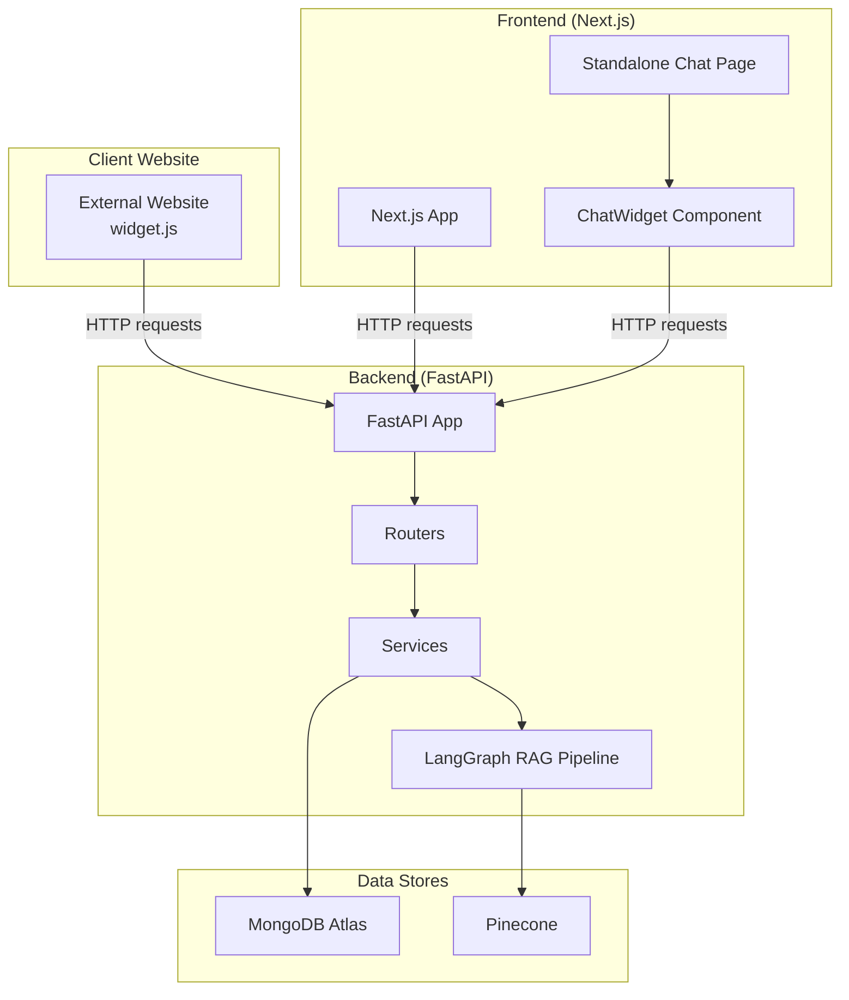
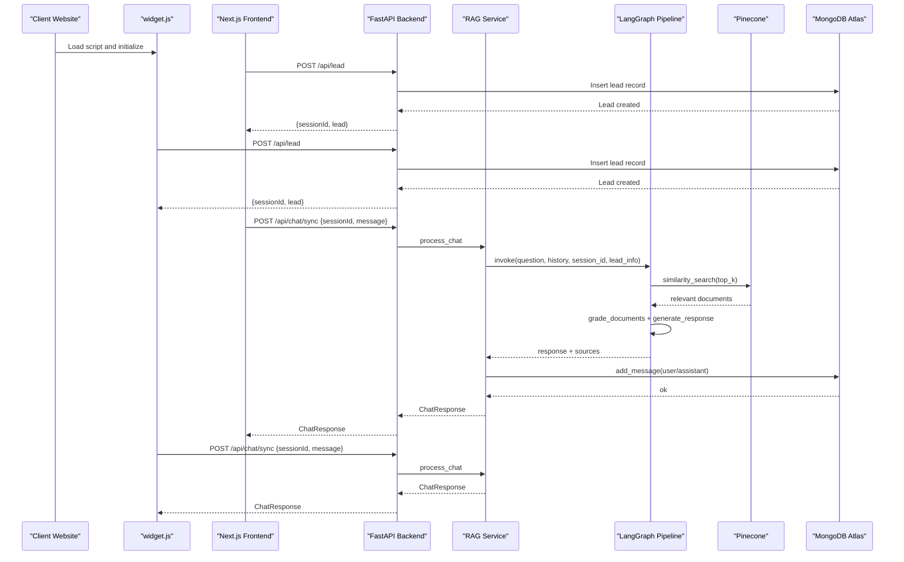
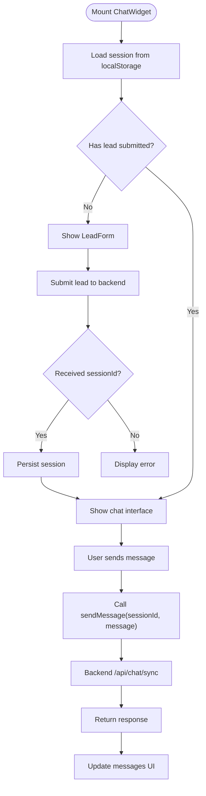
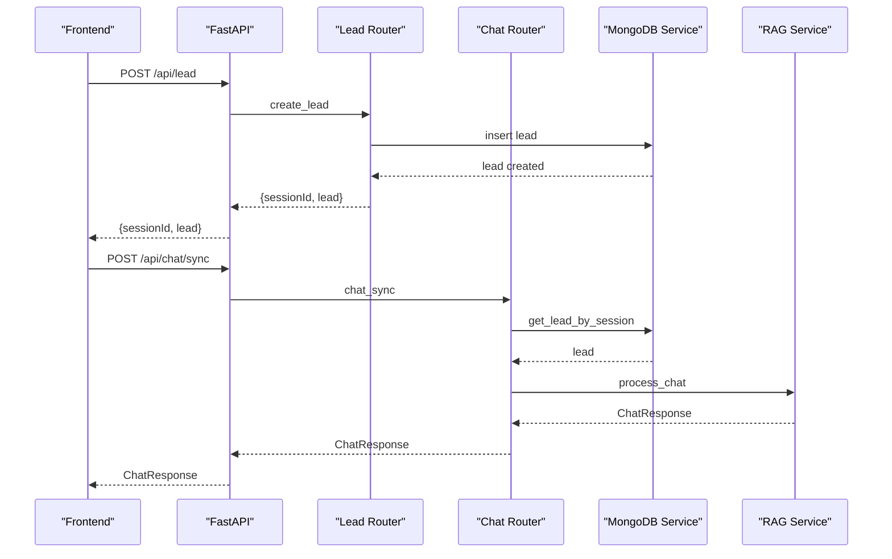
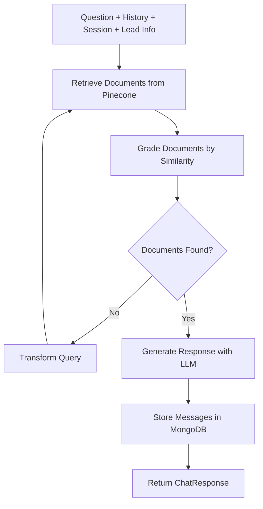
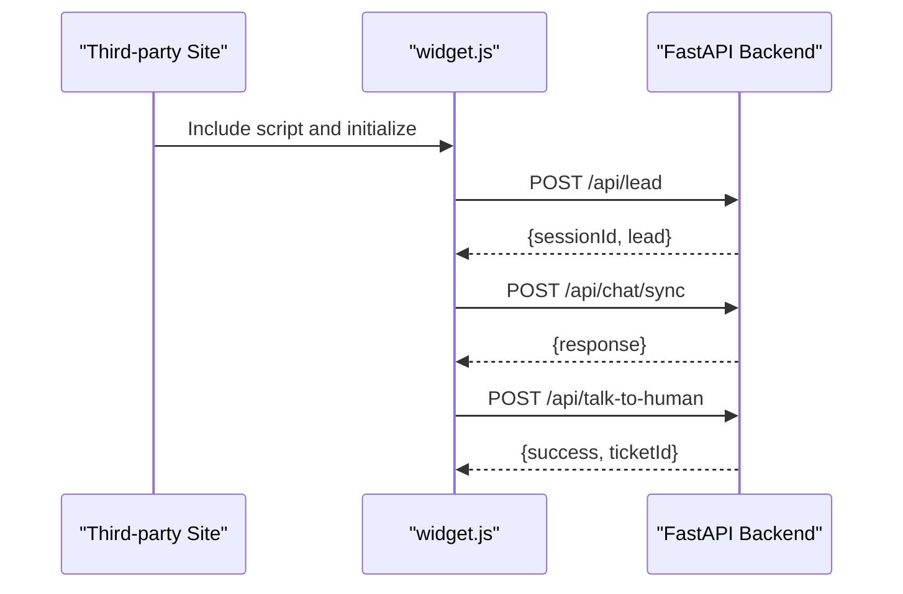
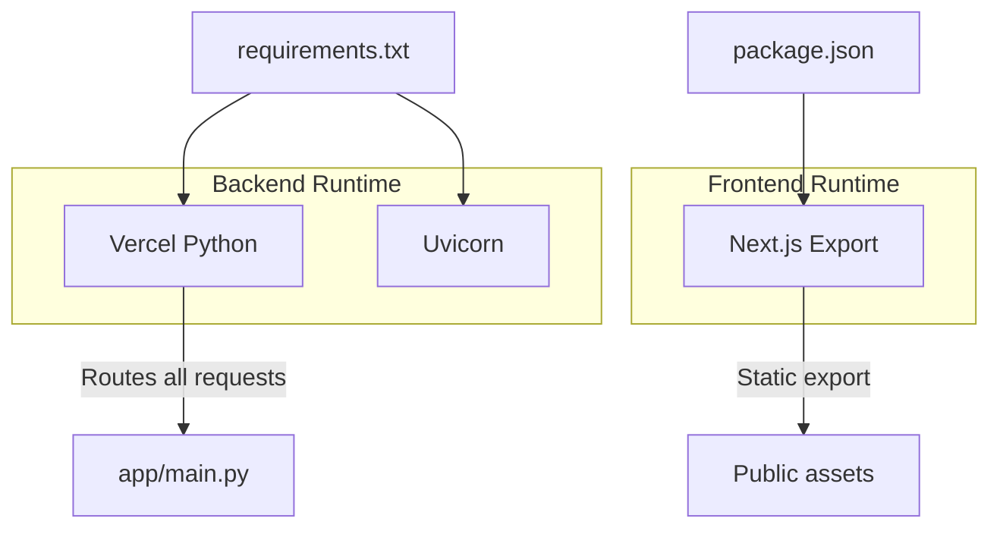

# High-Level Overview

<cite>
**Referenced Files in This Document**
- [backend/app/main.py](file://backend/app/main.py)
- [backend/app/config.py](file://backend/app/config.py)
- [backend/app/routers/chat_router.py](file://backend/app/routers/chat_router.py)
- [backend/app/services/rag_service.py](file://backend/app/services/rag_service.py)
- [backend/app/graph/rag_graph.py](file://backend/app/graph/rag_graph.py)
- [backend/requirements.txt](file://backend/requirements.txt)
- [backend/vercel.json](file://backend/vercel.json)
- [frontend/app/layout.tsx](file://frontend/app/layout.tsx)
- [frontend/app/page.tsx](file://frontend/app/page.tsx)
- [frontend/components/chat/ChatWidget.tsx](file://frontend/components/chat/ChatWidget.tsx)
- [frontend/lib/api.ts](file://frontend/lib/api.ts)
- [frontend/package.json](file://frontend/package.json)
- [frontend/next.config.ts](file://frontend/next.config.ts)
- [widget.js](file://widget.js)
</cite>

## Table of Contents
1. [Introduction](#introduction)
2. [Project Structure](#project-structure)
3. [Core Components](#core-components)
4. [Architecture Overview](#architecture-overview)
5. [Detailed Component Analysis](#detailed-component-analysis)
6. [Dependency Analysis](#dependency-analysis)
7. [Performance Considerations](#performance-considerations)
8. [Troubleshooting Guide](#troubleshooting-guide)
9. [Conclusion](#conclusion)

## Introduction
This document provides a high-level overview of the Hitech RAG Chatbot system architecture. It explains how client websites integrate via an embeddable widget, how the Next.js frontend supports both a standalone chat page and an embedded widget, and how the FastAPI backend orchestrates Retrieval-Augmented Generation (RAG) processing powered by LangGraph and Google Gemini, backed by Pinecone and MongoDB Atlas. It also covers the deployment topology with separate frontend and backend deployments on Vercel, and outlines cross-origin communication patterns and session management across different domains.

## Project Structure
The repository is organized into three main areas:
- Backend: FastAPI application with routers, services, and LangGraph-based RAG pipeline
- Frontend: Next.js application with a standalone chat page and reusable ChatWidget component
- External integration: A production-ready embeddable JavaScript widget for third-party websites

**Diagram sources**
- [backend/app/main.py:39-85](file://backend/app/main.py#L39-L85)
- [backend/app/routers/chat_router.py:12-129](file://backend/app/routers/chat_router.py#L12-L129)
- [backend/app/services/rag_service.py:19-87](file://backend/app/services/rag_service.py#L19-L87)
- [backend/app/graph/rag_graph.py:26-251](file://backend/app/graph/rag_graph.py#L26-L251)
- [frontend/app/page.tsx:1-12](file://frontend/app/page.tsx#L1-L12)
- [frontend/components/chat/ChatWidget.tsx:180-232](file://frontend/components/chat/ChatWidget.tsx#L180-L232)
- [widget.js:180-248](file://widget.js#L180-L248)

**Section sources**
- [backend/app/main.py:1-90](file://backend/app/main.py#L1-L90)
- [frontend/app/layout.tsx:1-20](file://frontend/app/layout.tsx#L1-L20)
- [frontend/app/page.tsx:1-12](file://frontend/app/page.tsx#L1-L12)
- [widget.js:1-800](file://widget.js#L1-L800)

## Core Components
- Frontend Next.js application:
  - Standalone chat page that hosts the embedded ChatWidget
  - ChatWidget component supporting lead capture, chat UI, and human escalation
  - API client module encapsulating HTTP calls to the backend
- Backend FastAPI application:
  - Centralized CORS configuration enabling widget embedding
  - Routers exposing endpoints for lead submission, synchronous chat, escalation, and conversation retrieval
  - Services managing MongoDB and Pinecone integrations, and orchestrating the RAG pipeline
  - LangGraph-based RAG pipeline integrating Google Gemini for contextual responses
- External embeddable widget:
  - Self-contained script for third-party websites
  - Handles lead capture, message exchange, and session persistence via localStorage
  - Communicates with the backend using fetch APIs

**Section sources**
- [frontend/app/page.tsx:1-12](file://frontend/app/page.tsx#L1-L12)
- [frontend/components/chat/ChatWidget.tsx:1-307](file://frontend/components/chat/ChatWidget.tsx#L1-L307)
- [frontend/lib/api.ts:1-93](file://frontend/lib/api.ts#L1-L93)
- [backend/app/main.py:39-85](file://backend/app/main.py#L39-L85)
- [backend/app/routers/chat_router.py:12-129](file://backend/app/routers/chat_router.py#L12-L129)
- [backend/app/services/rag_service.py:19-87](file://backend/app/services/rag_service.py#L19-L87)
- [backend/app/graph/rag_graph.py:26-251](file://backend/app/graph/rag_graph.py#L26-L251)
- [widget.js:180-248](file://widget.js#L180-L248)

## Architecture Overview
The system follows a client-server pattern with two distinct frontends:
- A standalone Next.js page that renders the ChatWidget as a full-page embedded experience
- An embeddable widget script that third-party websites can include to add chat functionality

The backend exposes REST endpoints consumed by both frontends. The RAG pipeline retrieves relevant knowledge from Pinecone, augments prompts with conversation history and lead information, and generates responses using Google Gemini. Responses are stored in MongoDB for persistence and future retrieval.

**Diagram sources**
- [frontend/lib/api.ts:61-80](file://frontend/lib/api.ts#L61-L80)
- [widget.js:181-225](file://widget.js#L181-L225)
- [backend/app/routers/chat_router.py:12-47](file://backend/app/routers/chat_router.py#L12-L47)
- [backend/app/services/rag_service.py:19-87](file://backend/app/services/rag_service.py#L19-L87)
- [backend/app/graph/rag_graph.py:221-251](file://backend/app/graph/rag_graph.py#L221-L251)

## Detailed Component Analysis

### Frontend: Next.js Standalone Page and ChatWidget
- Standalone page:
  - Renders the ChatWidget in embedded mode for direct access
- ChatWidget:
  - Manages local session storage with TTL and persists messages
  - Handles lead capture, welcome messages, typing indicators, and human escalation
  - Integrates with the API client to communicate with the backend

**Diagram sources**
- [frontend/components/chat/ChatWidget.tsx:38-142](file://frontend/components/chat/ChatWidget.tsx#L38-L142)
- [frontend/lib/api.ts:66-72](file://frontend/lib/api.ts#L66-L72)

**Section sources**
- [frontend/app/page.tsx:1-12](file://frontend/app/page.tsx#L1-L12)
- [frontend/components/chat/ChatWidget.tsx:1-307](file://frontend/components/chat/ChatWidget.tsx#L1-L307)
- [frontend/lib/api.ts:1-93](file://frontend/lib/api.ts#L1-L93)

### Backend: FastAPI Application and Routers
- Application lifecycle:
  - Initializes MongoDB, Pinecone, and embedding service during startup
  - Provides health checks and root endpoint
- CORS configuration:
  - Enables cross-origin requests for the embeddable widget
- Routers:
  - Lead submission endpoint creates a lead and returns a session identifier
  - Synchronous chat endpoint validates session, checks escalation, runs RAG, and stores messages
  - Human escalation endpoint marks conversation as escalated and records notes
  - Conversation retrieval endpoint returns stored messages

**Diagram sources**
- [backend/app/main.py:39-85](file://backend/app/main.py#L39-L85)
- [backend/app/routers/chat_router.py:12-47](file://backend/app/routers/chat_router.py#L12-L47)
- [backend/app/services/rag_service.py:19-87](file://backend/app/services/rag_service.py#L19-L87)

**Section sources**
- [backend/app/main.py:14-37](file://backend/app/main.py#L14-L37)
- [backend/app/main.py:50-57](file://backend/app/main.py#L50-L57)
- [backend/app/routers/chat_router.py:12-129](file://backend/app/routers/chat_router.py#L12-L129)

### Backend: RAG Service and LangGraph Pipeline
- RAGService:
  - Builds conversation history for context
  - Invokes the LangGraph pipeline with question, history, session_id, and lead_info
  - Persists user and assistant messages with metadata
- LangGraph pipeline:
  - Retrieves documents from Pinecone with configurable top_k and similarity threshold
  - Grades documents and decides whether to transform the query or generate a response
  - Generates responses using Google Gemini with a tailored system prompt incorporating lead information and conversation history

**Diagram sources**
- [backend/app/services/rag_service.py:19-87](file://backend/app/services/rag_service.py#L19-L87)
- [backend/app/graph/rag_graph.py:71-219](file://backend/app/graph/rag_graph.py#L71-L219)

**Section sources**
- [backend/app/services/rag_service.py:19-106](file://backend/app/services/rag_service.py#L19-L106)
- [backend/app/graph/rag_graph.py:26-251](file://backend/app/graph/rag_graph.py#L26-L251)

### External Embeddable Widget
- Initialization:
  - Reads configuration from script attributes and global variables
  - Supports customization of colors, position, and messaging
- Session management:
  - Uses localStorage with TTL to persist sessionId, lead info, and messages
- API interactions:
  - Submits leads, sends messages synchronously, and escalates to human
  - Displays typing indicators and error handling

**Diagram sources**
- [widget.js:14-27](file://widget.js#L14-L27)
- [widget.js:181-248](file://widget.js#L181-L248)

**Section sources**
- [widget.js:1-800](file://widget.js#L1-L800)

## Dependency Analysis
- Technology stack overview:
  - Backend: FastAPI, LangGraph, Google Gemini, Pinecone, MongoDB Atlas
  - Frontend: Next.js, React, Axios
  - External integration: Vanilla JavaScript widget
- Deployment topology:
  - Backend deployed on Vercel Python with a single entry point routing all requests to the FastAPI application
  - Frontend built as static Next.js with export output and served independently

**Diagram sources**
- [backend/requirements.txt:1-48](file://backend/requirements.txt#L1-L48)
- [backend/vercel.json:1-22](file://backend/vercel.json#L1-L22)
- [frontend/package.json:1-37](file://frontend/package.json#L1-L37)
- [frontend/next.config.ts:1-15](file://frontend/next.config.ts#L1-L15)

**Section sources**
- [backend/requirements.txt:1-48](file://backend/requirements.txt#L1-L48)
- [backend/vercel.json:1-22](file://backend/vercel.json#L1-L22)
- [frontend/package.json:1-37](file://frontend/package.json#L1-L37)
- [frontend/next.config.ts:1-15](file://frontend/next.config.ts#L1-L15)

## Performance Considerations
- RAG pipeline:
  - Top-K and similarity threshold reduce irrelevant document retrieval
  - Query transformation limits repeated low-relevance searches
- Frontend:
  - LocalStorage caching reduces repeated network calls for session restoration
  - Auto-resize textarea and throttled updates improve UX responsiveness
- Backend:
  - Singleton embedding service and compiled LangGraph pipeline minimize initialization overhead
  - Health checks expose service connectivity status

[No sources needed since this section provides general guidance]

## Troubleshooting Guide
- Cross-origin issues:
  - Verify CORS origins list includes the frontend domain and any embedder sites
  - Confirm the backend CORS middleware is configured to allow credentials and required headers
- Session persistence:
  - Check localStorage availability and quota limits in the browser
  - Ensure session TTL aligns with backend configuration
- Backend health:
  - Use the health endpoint to confirm MongoDB and Pinecone connections
- Network errors:
  - Inspect API client and widget fetch calls for network failures and error messages

**Section sources**
- [backend/app/main.py:50-57](file://backend/app/main.py#L50-L57)
- [backend/app/config.py:54-58](file://backend/app/config.py#L54-L58)
- [frontend/lib/api.ts:61-90](file://frontend/lib/api.ts#L61-L90)
- [widget.js:196-202](file://widget.js#L196-L202)

## Conclusion
The Hitech RAG Chatbot integrates a robust backend powered by FastAPI, LangGraph, and Google Gemini with scalable data stores (Pinecone and MongoDB Atlas). The frontend offers both a standalone chat experience and an embeddable widget for third-party sites. With explicit CORS configuration and session management across domains, the system enables seamless cross-origin communication and persistent user experiences.

[No sources needed since this section summarizes without analyzing specific files]