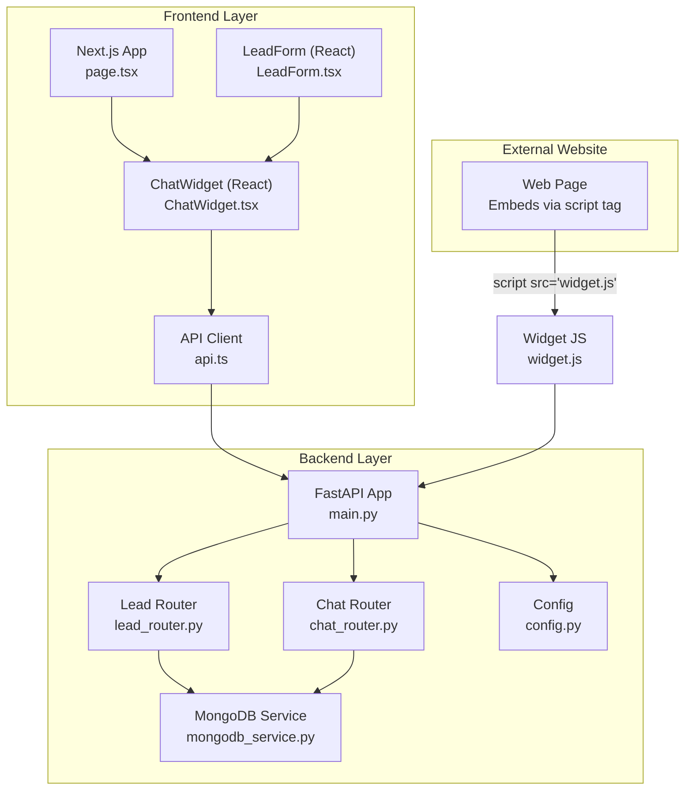
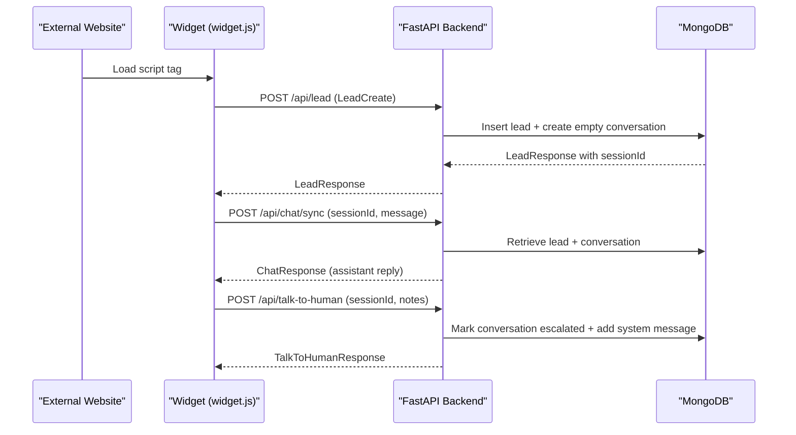
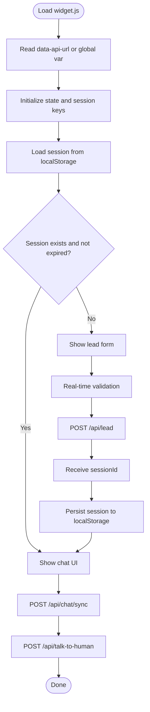
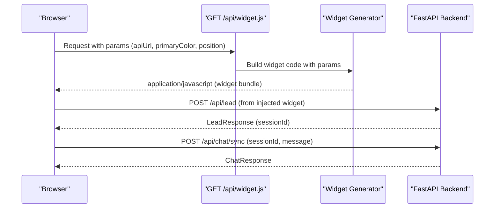
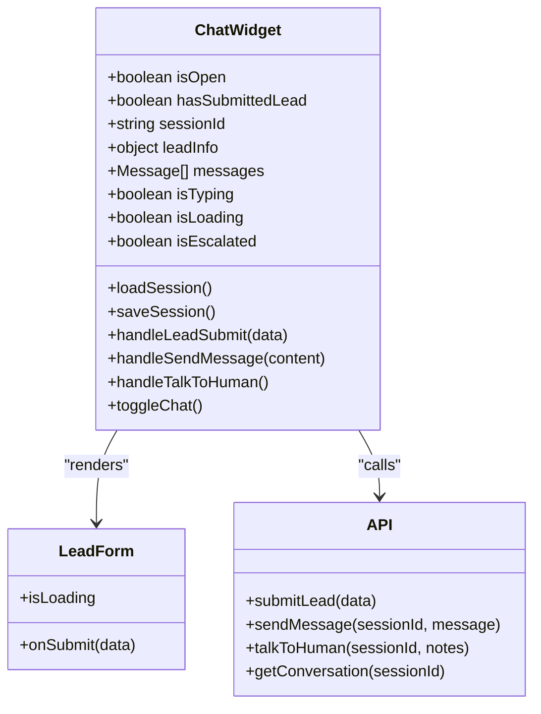
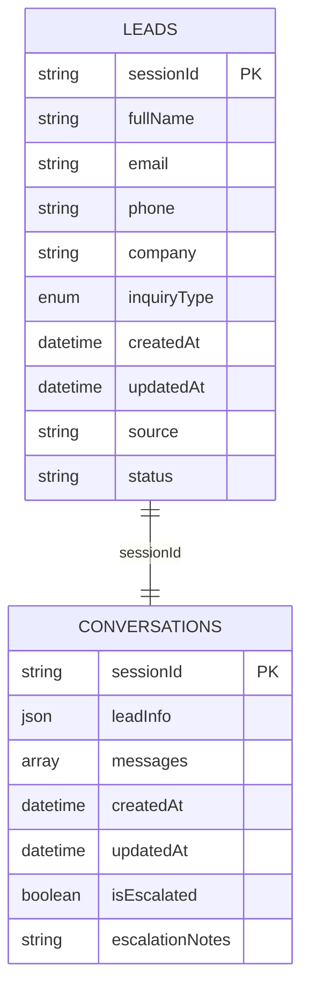
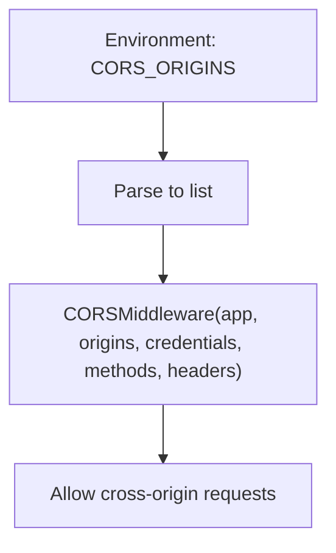
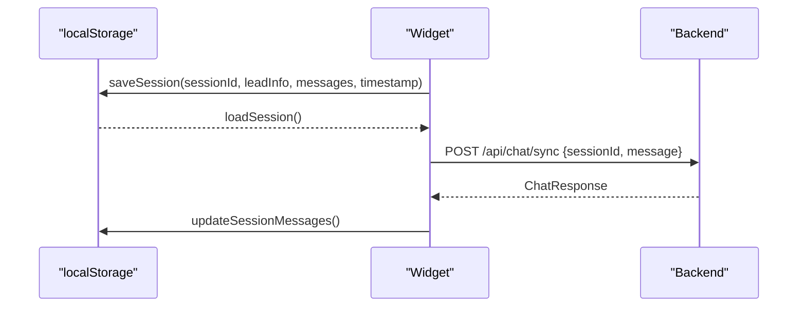
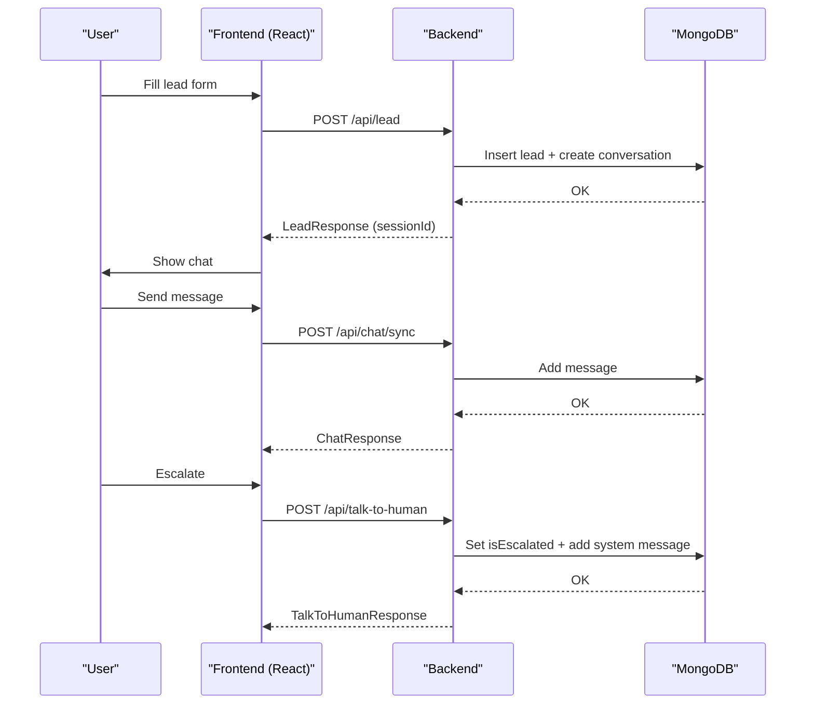
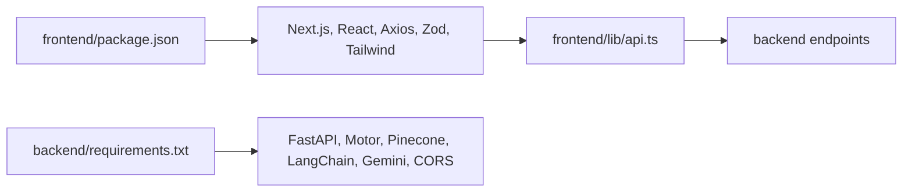

# Integration Patterns

<cite>
**Referenced Files in This Document**
- [widget.js](file://widget.js)
- [index.html](file://index.html)
- [frontend/app/api/widget.js/route.ts](file://frontend/app/api/widget.js/route.ts)
- [frontend/components/chat/ChatWidget.tsx](file://frontend/components/chat/ChatWidget.tsx)
- [frontend/lib/api.ts](file://frontend/lib/api.ts)
- [frontend/components/chat/LeadForm.tsx](file://frontend/components/chat/LeadForm.tsx)
- [backend/app/main.py](file://backend/app/main.py)
- [backend/app/config.py](file://backend/app/config.py)
- [backend/app/routers/lead_router.py](file://backend/app/routers/lead_router.py)
- [backend/app/routers/chat_router.py](file://backend/app/routers/chat_router.py)
- [backend/app/services/mongodb_service.py](file://backend/app/services/mongodb_service.py)
- [backend/app/models/lead.py](file://backend/app/models/lead.py)
- [backend/app/models/conversation.py](file://backend/app/models/conversation.py)
- [backend/vercel.json](file://backend/vercel.json)
- [frontend/package.json](file://frontend/package.json)
- [backend/requirements.txt](file://backend/requirements.txt)
</cite>

## Table of Contents
1. [Introduction](#introduction)
2. [Project Structure](#project-structure)
3. [Core Components](#core-components)
4. [Architecture Overview](#architecture-overview)
5. [Detailed Component Analysis](#detailed-component-analysis)
6. [Dependency Analysis](#dependency-analysis)
7. [Performance Considerations](#performance-considerations)
8. [Troubleshooting Guide](#troubleshooting-guide)
9. [Conclusion](#conclusion)

## Introduction
This document explains the system’s integration patterns and cross-origin communication strategies for embedding a production-ready RAG-powered chat widget. It covers:
- How external websites integrate via script tags and Next.js dynamic widget endpoint
- The widget generation endpoint and parameter handling
- Cross-origin resource sharing configuration
- Session management across domains using localStorage and backend-managed sessions
- API communication patterns between widgets, frontend, and backend
- Lead capture flow, conversation persistence, and human escalation workflows
- Security considerations for cross-origin communication, CORS configuration, and data privacy protection

## Project Structure
The system comprises:
- A static HTML/JavaScript embeddable widget (widget.js) for standalone integration
- A Next.js page that serves a dynamically generated widget bundle with runtime parameters
- A React-based ChatWidget component for embedded use within a Next.js app
- A FastAPI backend exposing REST endpoints for lead capture, chat, and escalation
- MongoDB-backed persistence for leads and conversations

**Diagram sources**
- [widget.js:1-895](file://widget.js#L1-L895)
- [frontend/app/api/widget.js/route.ts:1-347](file://frontend/app/api/widget.js/route.ts#L1-L347)
- [frontend/components/chat/ChatWidget.tsx:1-307](file://frontend/components/chat/ChatWidget.tsx#L1-L307)
- [frontend/lib/api.ts:1-93](file://frontend/lib/api.ts#L1-L93)
- [backend/app/main.py:1-90](file://backend/app/main.py#L1-L90)
- [backend/app/routers/lead_router.py:1-57](file://backend/app/routers/lead_router.py#L1-L57)
- [backend/app/routers/chat_router.py:1-130](file://backend/app/routers/chat_router.py#L1-L130)
- [backend/app/services/mongodb_service.py:1-202](file://backend/app/services/mongodb_service.py#L1-L202)
- [backend/app/config.py:1-65](file://backend/app/config.py#L1-L65)

**Section sources**
- [widget.js:1-895](file://widget.js#L1-L895)
- [frontend/app/api/widget.js/route.ts:1-347](file://frontend/app/api/widget.js/route.ts#L1-L347)
- [frontend/components/chat/ChatWidget.tsx:1-307](file://frontend/components/chat/ChatWidget.tsx#L1-L307)
- [frontend/lib/api.ts:1-93](file://frontend/lib/api.ts#L1-L93)
- [backend/app/main.py:1-90](file://backend/app/main.py#L1-L90)
- [backend/app/config.py:1-65](file://backend/app/config.py#L1-L65)

## Core Components
- Embeddable widget (widget.js): Self-contained JavaScript that injects a floating chat UI, validates lead data, persists session in localStorage, and communicates with backend endpoints.
- Next.js dynamic widget endpoint: Generates a widget bundle with runtime parameters (apiUrl, primaryColor, position) and injects it into the page.
- React ChatWidget: A reusable component that manages session state, renders lead capture and chat UI, and integrates with the API client.
- API client (frontend/lib/api.ts): Centralized Axios client for lead submission, chat sync, escalation, and conversation retrieval.
- Backend FastAPI app: Exposes endpoints for lead creation, synchronous chat, escalation, and conversation retrieval with CORS configured.
- MongoDB service: Provides CRUD operations for leads and conversations, indexing, and escalation updates.

**Section sources**
- [widget.js:1-895](file://widget.js#L1-L895)
- [frontend/app/api/widget.js/route.ts:1-347](file://frontend/app/api/widget.js/route.ts#L1-L347)
- [frontend/components/chat/ChatWidget.tsx:1-307](file://frontend/components/chat/ChatWidget.tsx#L1-L307)
- [frontend/lib/api.ts:1-93](file://frontend/lib/api.ts#L1-L93)
- [backend/app/main.py:1-90](file://backend/app/main.py#L1-L90)
- [backend/app/services/mongodb_service.py:1-202](file://backend/app/services/mongodb_service.py#L1-L202)

## Architecture Overview
The integration supports two deployment modes:
- Standalone embed via script tag: Loads widget.js and posts to backend endpoints.
- Next.js dynamic widget: Uses a server-side route to generate a widget bundle with runtime parameters.

Cross-origin communication relies on CORS configuration in the backend and consistent session identifiers passed via request bodies.

**Diagram sources**
- [widget.js:181-248](file://widget.js#L181-L248)
- [backend/app/routers/lead_router.py:11-44](file://backend/app/routers/lead_router.py#L11-L44)
- [backend/app/routers/chat_router.py:12-117](file://backend/app/routers/chat_router.py#L12-L117)
- [backend/app/services/mongodb_service.py:51-180](file://backend/app/services/mongodb_service.py#L51-L180)

## Detailed Component Analysis

### Embeddable Widget Architecture (widget.js)
- Configuration: Reads data-api-url attribute or global variable, defines branding and behavior.
- Session persistence: Saves/loads sessionId, lead info, and messages to localStorage with TTL.
- UI composition: Builds floating chat UI with lead form, message bubbles, typing indicator, and “Talk to Human” button.
- API integration: Submits lead, sends messages, escalates to human via fetch to backend endpoints.
- Validation: Real-time client-side validation for Saudi phone numbers and required fields.

**Diagram sources**
- [widget.js:14-108](file://widget.js#L14-L108)
- [widget.js:483-696](file://widget.js#L483-L696)
- [widget.js:181-248](file://widget.js#L181-L248)

**Section sources**
- [widget.js:14-108](file://widget.js#L14-L108)
- [widget.js:483-696](file://widget.js#L483-L696)
- [widget.js:181-248](file://widget.js#L181-L248)

### Next.js Dynamic Widget Endpoint
- Purpose: Generates a self-contained widget bundle with runtime parameters (apiUrl, primaryColor, position).
- Behavior: Injects a floating chat UI, handles lead capture and chat rendering, and posts to backend endpoints.
- Parameter handling: Reads query parameters and injects them into the generated script.

**Diagram sources**
- [frontend/app/api/widget.js/route.ts:3-346](file://frontend/app/api/widget.js/route.ts#L3-L346)

**Section sources**
- [frontend/app/api/widget.js/route.ts:3-346](file://frontend/app/api/widget.js/route.ts#L3-L346)

### React ChatWidget Component
- Session lifecycle: Loads from localStorage on mount, saves on changes, enforces TTL.
- UI flow: Renders LeadForm until lead is submitted; then renders chat with messages and input.
- API integration: Uses frontend/lib/api.ts for lead submission, chat sync, escalation, and conversation retrieval.
- Human escalation: Confirms escalation, posts to backend, and displays system message.

**Diagram sources**
- [frontend/components/chat/ChatWidget.tsx:27-306](file://frontend/components/chat/ChatWidget.tsx#L27-L306)
- [frontend/components/chat/LeadForm.tsx:28-167](file://frontend/components/chat/LeadForm.tsx#L28-L167)
- [frontend/lib/api.ts:61-92](file://frontend/lib/api.ts#L61-L92)

**Section sources**
- [frontend/components/chat/ChatWidget.tsx:27-306](file://frontend/components/chat/ChatWidget.tsx#L27-L306)
- [frontend/components/chat/LeadForm.tsx:28-167](file://frontend/components/chat/LeadForm.tsx#L28-L167)
- [frontend/lib/api.ts:61-92](file://frontend/lib/api.ts#L61-L92)

### Backend API Endpoints and Data Models
- Lead submission: Creates a new lead, generates sessionId, initializes empty conversation, and returns LeadResponse.
- Chat sync: Validates session, checks escalation flag, runs RAG pipeline, stores messages, returns assistant response.
- Talk to human: Validates session, marks conversation escalated, adds system message, returns confirmation.
- Conversation retrieval: Fetches conversation by sessionId for debugging or analytics.

**Diagram sources**
- [backend/app/models/lead.py:46-64](file://backend/app/models/lead.py#L46-L64)
- [backend/app/models/conversation.py:34-53](file://backend/app/models/conversation.py#L34-L53)
- [backend/app/services/mongodb_service.py:51-180](file://backend/app/services/mongodb_service.py#L51-L180)

**Section sources**
- [backend/app/routers/lead_router.py:11-57](file://backend/app/routers/lead_router.py#L11-L57)
- [backend/app/routers/chat_router.py:12-130](file://backend/app/routers/chat_router.py#L12-L130)
- [backend/app/models/lead.py:18-64](file://backend/app/models/lead.py#L18-L64)
- [backend/app/models/conversation.py:15-53](file://backend/app/models/conversation.py#L15-L53)
- [backend/app/services/mongodb_service.py:51-180](file://backend/app/services/mongodb_service.py#L51-L180)

### Cross-Origin Communication and CORS
- CORS configuration: FastAPI app adds CORSMiddleware with origins parsed from environment variable CORS_ORIGINS.
- Origins parsing: Supports wildcard "*" or comma-separated list; injected into middleware.
- Runtime widget parameters: Next.js route allows passing apiUrl, primaryColor, and position to tailor the widget.

**Diagram sources**
- [backend/app/config.py:46-58](file://backend/app/config.py#L46-L58)
- [backend/app/main.py:50-57](file://backend/app/main.py#L50-L57)
- [frontend/app/api/widget.js/route.ts:4-8](file://frontend/app/api/widget.js/route.ts#L4-L8)

**Section sources**
- [backend/app/config.py:46-58](file://backend/app/config.py#L46-L58)
- [backend/app/main.py:50-57](file://backend/app/main.py#L50-L57)
- [frontend/app/api/widget.js/route.ts:4-8](file://frontend/app/api/widget.js/route.ts#L4-L8)

### Session Management Across Domains
- Client-side persistence: localStorage stores sessionId, leadInfo, messages, and timestamp; TTL enforced.
- Backend session identity: sessionId is the single source of truth; passed in request bodies for chat and escalation.
- Domain separation: widget.js and Next.js components both rely on the same sessionId; localStorage isolation per origin prevents leakage.

**Diagram sources**
- [widget.js:47-122](file://widget.js#L47-L122)
- [frontend/components/chat/ChatWidget.tsx:38-77](file://frontend/components/chat/ChatWidget.tsx#L38-L77)
- [backend/app/routers/chat_router.py:28-47](file://backend/app/routers/chat_router.py#L28-L47)

**Section sources**
- [widget.js:47-122](file://widget.js#L47-L122)
- [frontend/components/chat/ChatWidget.tsx:38-77](file://frontend/components/chat/ChatWidget.tsx#L38-L77)
- [backend/app/routers/chat_router.py:28-47](file://backend/app/routers/chat_router.py#L28-L47)

### Lead Capture Flow, Conversation Persistence, and Escalation
- Lead capture: Validates input, submits to backend, receives sessionId, and transitions to chat.
- Conversation persistence: MongoDB stores messages with roles and timestamps; retrieval limited to recent messages.
- Escalation: Marks conversation escalated, adds system message, and returns confirmation; chat endpoint returns escalation notice.

**Diagram sources**
- [frontend/lib/api.ts:61-92](file://frontend/lib/api.ts#L61-L92)
- [backend/app/routers/lead_router.py:11-44](file://backend/app/routers/lead_router.py#L11-L44)
- [backend/app/routers/chat_router.py:12-117](file://backend/app/routers/chat_router.py#L12-L117)
- [backend/app/services/mongodb_service.py:98-180](file://backend/app/services/mongodb_service.py#L98-L180)

**Section sources**
- [frontend/lib/api.ts:61-92](file://frontend/lib/api.ts#L61-L92)
- [backend/app/routers/lead_router.py:11-44](file://backend/app/routers/lead_router.py#L11-L44)
- [backend/app/routers/chat_router.py:12-117](file://backend/app/routers/chat_router.py#L12-L117)
- [backend/app/services/mongodb_service.py:98-180](file://backend/app/services/mongodb_service.py#L98-L180)

## Dependency Analysis
- Frontend dependencies: Next.js, React, Axios, react-hook-form, zod, TailwindCSS.
- Backend dependencies: FastAPI, uvicorn, motor (MongoDB), pinecone-client, langchain, google-generativeai, starlette (CORS).
- Integration points: API client in frontend consumes backend endpoints; widget code in Next.js route mirrors standalone widget behavior.

**Diagram sources**
- [frontend/package.json:11-35](file://frontend/package.json#L11-L35)
- [backend/requirements.txt:1-48](file://backend/requirements.txt#L1-48)
- [frontend/lib/api.ts:6-11](file://frontend/lib/api.ts#L6-L11)

**Section sources**
- [frontend/package.json:11-35](file://frontend/package.json#L11-L35)
- [backend/requirements.txt:1-48](file://backend/requirements.txt#L1-48)
- [frontend/lib/api.ts:6-11](file://frontend/lib/api.ts#L6-L11)

## Performance Considerations
- Client-side caching: localStorage reduces repeated lead submissions and preserves conversation continuity.
- Message limits: Backend retrieves recent messages only, preventing large payloads.
- CDN-friendly widget: Next.js route caches the generated widget bundle for a short period.
- Indexing: MongoDB indexes on sessionId and createdAt improve lookup performance.

[No sources needed since this section provides general guidance]

## Troubleshooting Guide
- CORS errors: Verify CORS_ORIGINS environment variable includes the external domain(s).
- Session not found: Ensure sessionId is present in request body for chat and escalation endpoints.
- Network failures: Widget code surfaces generic network errors; check backend availability and API URL.
- Escalation not reflected: Confirm conversation is marked escalated and system message is added.

**Section sources**
- [backend/app/config.py:46-58](file://backend/app/config.py#L46-L58)
- [backend/app/routers/chat_router.py:28-47](file://backend/app/routers/chat_router.py#L28-L47)
- [widget.js:196-202](file://widget.js#L196-L202)

## Conclusion
The system provides robust integration patterns for embedding a chat widget across domains:
- Two integration modes: script-tag embed and Next.js dynamic widget endpoint
- Clear session management via sessionId and localStorage
- Secure cross-origin communication powered by configurable CORS
- End-to-end lead capture, conversation persistence, and human escalation workflows
- Strong separation of concerns between frontend components and backend services

[No sources needed since this section summarizes without analyzing specific files]