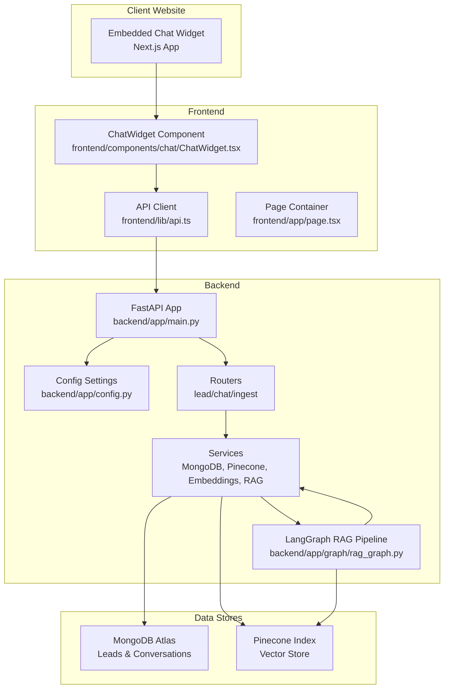
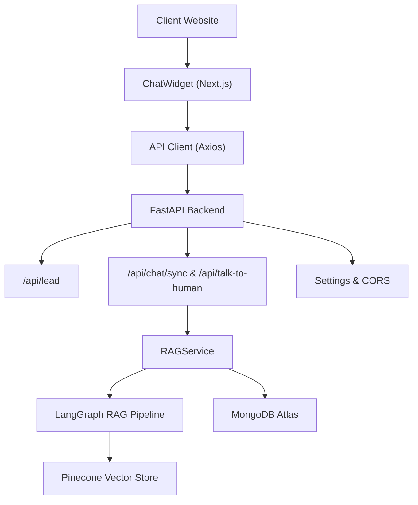
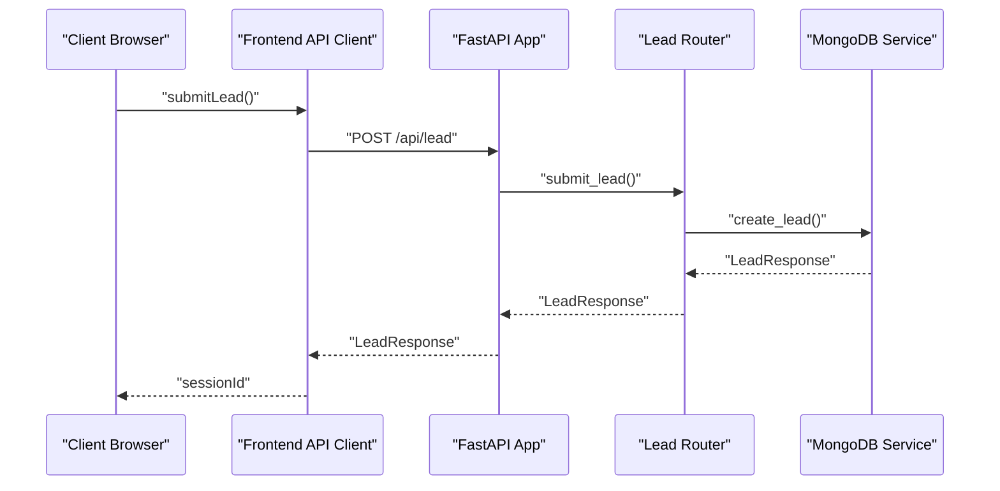
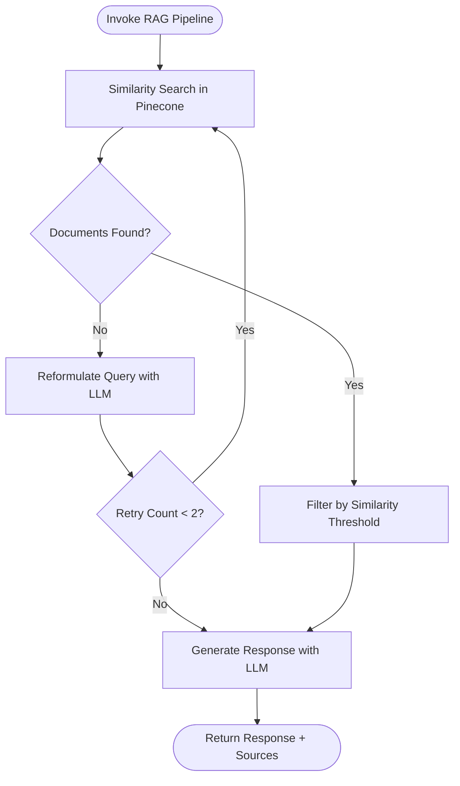
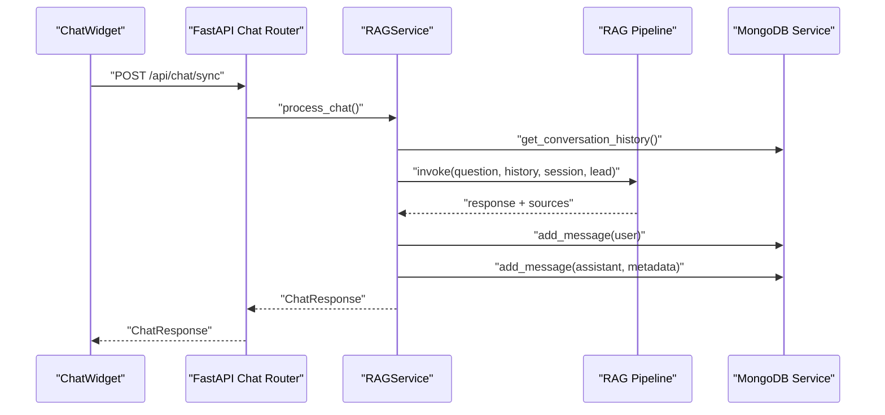
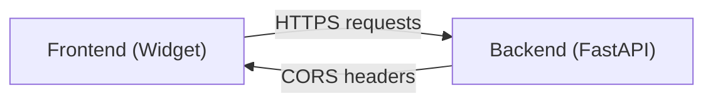
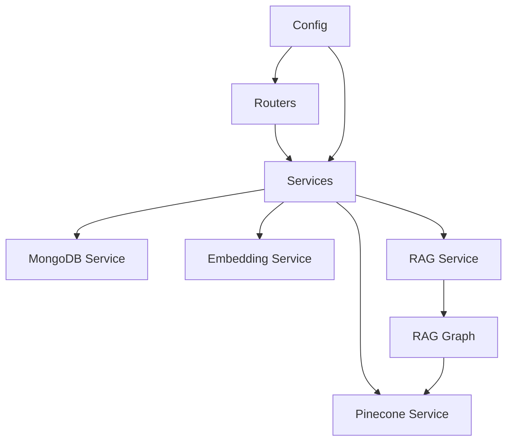

# System Architecture

<cite>
**Referenced Files in This Document**
- [backend/app/main.py](file://backend/app/main.py)
- [backend/app/config.py](file://backend/app/config.py)
- [backend/app/graph/rag_graph.py](file://backend/app/graph/rag_graph.py)
- [backend/app/services/rag_service.py](file://backend/app/services/rag_service.py)
- [backend/app/services/mongodb_service.py](file://backend/app/services/mongodb_service.py)
- [backend/app/services/pinecone_service.py](file://backend/app/services/pinecone_service.py)
- [backend/app/services/embedding_service.py](file://backend/app/services/embedding_service.py)
- [backend/app/routers/chat_router.py](file://backend/app/routers/chat_router.py)
- [backend/app/routers/lead_router.py](file://backend/app/routers/lead_router.py)
- [backend/app/models/chat.py](file://backend/app/models/chat.py)
- [frontend/lib/api.ts](file://frontend/lib/api.ts)
- [frontend/components/chat/ChatWidget.tsx](file://frontend/components/chat/ChatWidget.tsx)
- [frontend/app/page.tsx](file://frontend/app/page.tsx)
</cite>

## Table of Contents
1. [Introduction](#introduction)
2. [Project Structure](#project-structure)
3. [Core Components](#core-components)
4. [Architecture Overview](#architecture-overview)
5. [Detailed Component Analysis](#detailed-component-analysis)
6. [Dependency Analysis](#dependency-analysis)
7. [Performance Considerations](#performance-considerations)
8. [Troubleshooting Guide](#troubleshooting-guide)
9. [Conclusion](#conclusion)

## Introduction
This document describes the system architecture of the Hitech RAG Chatbot, a Python-FastAPI backend integrated with a Next.js frontend and powered by LangGraph, Google Gemini, Pinecone, and MongoDB Atlas. The system enables clients to embed a chat widget on their websites, capture lead information, maintain conversational sessions, and deliver AI-driven responses using Retrieval-Augmented Generation (RAG). It also supports escalation to human agents and maintains conversation history for context-aware responses.

## Project Structure
The repository is organized into three primary areas:
- Backend: FastAPI application with routers, services, models, and LangGraph pipeline
- Frontend: Next.js application with a chat widget and API client
- Knowledge base: Placeholder for ingestion workflows and content preparation

**Diagram sources**
- [backend/app/main.py:1-90](file://backend/app/main.py#L1-L90)
- [backend/app/config.py:1-65](file://backend/app/config.py#L1-L65)
- [backend/app/graph/rag_graph.py:1-264](file://backend/app/graph/rag_graph.py#L1-L264)
- [backend/app/services/mongodb_service.py:1-202](file://backend/app/services/mongodb_service.py#L1-L202)
- [backend/app/services/pinecone_service.py:1-186](file://backend/app/services/pinecone_service.py#L1-L186)
- [frontend/lib/api.ts:1-93](file://frontend/lib/api.ts#L1-L93)
- [frontend/components/chat/ChatWidget.tsx:1-307](file://frontend/components/chat/ChatWidget.tsx#L1-L307)
- [frontend/app/page.tsx:1-12](file://frontend/app/page.tsx#L1-L12)

**Section sources**
- [backend/app/main.py:1-90](file://backend/app/main.py#L1-L90)
- [backend/app/config.py:1-65](file://backend/app/config.py#L1-L65)
- [frontend/lib/api.ts:1-93](file://frontend/lib/api.ts#L1-L93)
- [frontend/components/chat/ChatWidget.tsx:1-307](file://frontend/components/chat/ChatWidget.tsx#L1-L307)
- [frontend/app/page.tsx:1-12](file://frontend/app/page.tsx#L1-L12)

## Core Components
- FastAPI Application: Central orchestration point with CORS middleware, health checks, and router registration.
- Configuration: Centralized settings for external services, RAG parameters, and session policies.
- MongoDB Service: Manages leads, conversations, message storage, and escalation states.
- Pinecone Service: Vector store operations for upserting and similarity search of embeddings.
- Embedding Service: Singleton BGE-M3 model for generating dense vector representations.
- LangGraph RAG Pipeline: Multi-step workflow for retrieval, filtering, query transformation, and generation.
- RAG Service: Coordinates conversation history, invokes the pipeline, and persists results.
- Chat and Lead Routers: Expose REST endpoints for synchronous chat, escalation, and lead/session management.
- Frontend API Client: Axios-based client for backend interactions.
- ChatWidget Component: React component managing session lifecycle, local persistence, and user interactions.

**Section sources**
- [backend/app/main.py:14-85](file://backend/app/main.py#L14-L85)
- [backend/app/config.py:7-64](file://backend/app/config.py#L7-L64)
- [backend/app/services/mongodb_service.py:13-201](file://backend/app/services/mongodb_service.py#L13-L201)
- [backend/app/services/pinecone_service.py:10-185](file://backend/app/services/pinecone_service.py#L10-L185)
- [backend/app/services/embedding_service.py:10-157](file://backend/app/services/embedding_service.py#L10-L157)
- [backend/app/graph/rag_graph.py:26-264](file://backend/app/graph/rag_graph.py#L26-L264)
- [backend/app/services/rag_service.py:11-116](file://backend/app/services/rag_service.py#L11-L116)
- [backend/app/routers/chat_router.py:12-130](file://backend/app/routers/chat_router.py#L12-L130)
- [backend/app/routers/lead_router.py:11-57](file://backend/app/routers/lead_router.py#L11-L57)
- [frontend/lib/api.ts:1-93](file://frontend/lib/api.ts#L1-L93)
- [frontend/components/chat/ChatWidget.tsx:24-77](file://frontend/components/chat/ChatWidget.tsx#L24-L77)

## Architecture Overview
The system follows a client-widget-first design:
- Client websites embed the Next.js ChatWidget, which communicates with the backend via HTTPS.
- The frontend persists session data locally for short-term continuity and sends requests to the backend API.
- The backend validates sessions, retrieves conversation context, executes the LangGraph RAG pipeline, and returns contextual answers enriched with sources.
- Data stores persist leads, conversations, and vector embeddings for retrieval.

**Diagram sources**
- [frontend/components/chat/ChatWidget.tsx:84-142](file://frontend/components/chat/ChatWidget.tsx#L84-L142)
- [frontend/lib/api.ts:61-80](file://frontend/lib/api.ts#L61-L80)
- [backend/app/routers/lead_router.py:11-38](file://backend/app/routers/lead_router.py#L11-L38)
- [backend/app/routers/chat_router.py:12-117](file://backend/app/routers/chat_router.py#L12-L117)
- [backend/app/services/rag_service.py:19-87](file://backend/app/services/rag_service.py#L19-L87)
- [backend/app/graph/rag_graph.py:221-251](file://backend/app/graph/rag_graph.py#L221-L251)
- [backend/app/services/pinecone_service.py:108-154](file://backend/app/services/pinecone_service.py#L108-L154)
- [backend/app/services/mongodb_service.py:117-133](file://backend/app/services/mongodb_service.py#L117-L133)
- [backend/app/main.py:39-85](file://backend/app/main.py#L39-L85)
- [backend/app/config.py:46-58](file://backend/app/config.py#L46-L58)

## Detailed Component Analysis

### Backend Application and Configuration
- Lifespan management initializes MongoDB, Pinecone, and the embedding model at startup and ensures clean shutdown.
- CORS middleware permits cross-origin access from configured origins, enabling widget embedding on external sites.
- Health endpoint reports service connectivity for MongoDB and Pinecone.

**Diagram sources**
- [frontend/lib/api.ts:61-64](file://frontend/lib/api.ts#L61-L64)
- [backend/app/routers/lead_router.py:11-38](file://backend/app/routers/lead_router.py#L11-L38)
- [backend/app/services/mongodb_service.py:51-77](file://backend/app/services/mongodb_service.py#L51-L77)

**Section sources**
- [backend/app/main.py:14-85](file://backend/app/main.py#L14-L85)
- [backend/app/config.py:46-58](file://backend/app/config.py#L46-L58)

### RAG Pipeline Architecture
The LangGraph pipeline implements a retrieval-augmented generation workflow:
- Retrieve: Query Pinecone with an embedding of the user’s question.
- Grade: Filter results by similarity threshold.
- Transform: If no relevant documents, reformulate the query using the LLM.
- Generate: Build a system prompt with company context, lead personalization, conversation history, and top-k documents, then generate a response.

**Diagram sources**
- [backend/app/graph/rag_graph.py:71-251](file://backend/app/graph/rag_graph.py#L71-L251)
- [backend/app/services/pinecone_service.py:108-154](file://backend/app/services/pinecone_service.py#L108-L154)
- [backend/app/services/embedding_service.py:55-77](file://backend/app/services/embedding_service.py#L55-L77)

**Section sources**
- [backend/app/graph/rag_graph.py:26-264](file://backend/app/graph/rag_graph.py#L26-L264)
- [backend/app/services/pinecone_service.py:108-154](file://backend/app/services/pinecone_service.py#L108-L154)
- [backend/app/services/embedding_service.py:55-77](file://backend/app/services/embedding_service.py#L55-L77)

### Session Management and Conversation Persistence
- Session creation: On lead submission, a unique session ID is generated and associated with a lead record and an empty conversation.
- Local persistence: The frontend stores session data in localStorage with TTL to improve UX across page reloads.
- Conversation history: Up to a configured maximum number of recent messages are passed to the RAG pipeline for context.
- Escalation: When a user requests a human agent, the conversation is marked escalated and a system message is appended.

**Diagram sources**
- [frontend/components/chat/ChatWidget.tsx:110-142](file://frontend/components/chat/ChatWidget.tsx#L110-L142)
- [backend/app/routers/chat_router.py:12-47](file://backend/app/routers/chat_router.py#L12-L47)
- [backend/app/services/rag_service.py:19-87](file://backend/app/services/rag_service.py#L19-L87)
- [backend/app/services/mongodb_service.py:117-133](file://backend/app/services/mongodb_service.py#L117-L133)

**Section sources**
- [frontend/components/chat/ChatWidget.tsx:24-77](file://frontend/components/chat/ChatWidget.tsx#L24-L77)
- [backend/app/services/mongodb_service.py:51-77](file://backend/app/services/mongodb_service.py#L51-L77)
- [backend/app/routers/chat_router.py:120-129](file://backend/app/routers/chat_router.py#L120-L129)

### Cross-Origin Communication
- CORS configuration allows embedding the widget on external domains by permitting credentials, headers, and methods.
- The frontend sets the base URL from environment variables, enabling deployment flexibility.

**Diagram sources**
- [backend/app/main.py:50-57](file://backend/app/main.py#L50-L57)
- [frontend/lib/api.ts:4](file://frontend/lib/api.ts#L4)

**Section sources**
- [backend/app/main.py:50-57](file://backend/app/main.py#L50-L57)
- [frontend/lib/api.ts:4](file://frontend/lib/api.ts#L4)

### Data Models and API Contracts
- ChatRequest/ChatResponse define the payload contracts for synchronous chat.
- TalkToHumanRequest/TalkToHumanResponse standardize escalation requests and confirmations.
- These models ensure type safety and consistent serialization across the frontend and backend.

**Section sources**
- [backend/app/models/chat.py:7-45](file://backend/app/models/chat.py#L7-L45)
- [frontend/lib/api.ts:29-58](file://frontend/lib/api.ts#L29-L58)

## Dependency Analysis
The backend exhibits layered cohesion:
- Routers depend on services for domain operations.
- Services encapsulate data store interactions and orchestrate the RAG pipeline.
- The RAG pipeline depends on Pinecone for vector retrieval and the embedding service for embeddings.
- Configuration centralizes environment-dependent settings.

**Diagram sources**
- [backend/app/routers/lead_router.py:11-38](file://backend/app/routers/lead_router.py#L11-L38)
- [backend/app/routers/chat_router.py:12-47](file://backend/app/routers/chat_router.py#L12-L47)
- [backend/app/services/rag_service.py:14-17](file://backend/app/services/rag_service.py#L14-L17)
- [backend/app/graph/rag_graph.py:29-38](file://backend/app/graph/rag_graph.py#L29-L38)
- [backend/app/services/pinecone_service.py:21-25](file://backend/app/services/pinecone_service.py#L21-L25)
- [backend/app/services/embedding_service.py:22-28](file://backend/app/services/embedding_service.py#L22-L28)
- [backend/app/config.py:7-64](file://backend/app/config.py#L7-L64)

**Section sources**
- [backend/app/routers/lead_router.py:11-38](file://backend/app/routers/lead_router.py#L11-L38)
- [backend/app/routers/chat_router.py:12-47](file://backend/app/routers/chat_router.py#L12-L47)
- [backend/app/services/rag_service.py:14-17](file://backend/app/services/rag_service.py#L14-L17)
- [backend/app/graph/rag_graph.py:29-38](file://backend/app/graph/rag_graph.py#L29-L38)
- [backend/app/services/pinecone_service.py:21-25](file://backend/app/services/pinecone_service.py#L21-L25)
- [backend/app/services/embedding_service.py:22-28](file://backend/app/services/embedding_service.py#L22-L28)
- [backend/app/config.py:7-64](file://backend/app/config.py#L7-L64)

## Performance Considerations
- Embedding model initialization is cached as a singleton to avoid repeated loads.
- Pinecone upserts are batched to optimize network overhead.
- Retrieval filters and similarity thresholds reduce irrelevant matches.
- Conversation history limits minimize prompt size and latency.
- Frontend local storage reduces redundant backend calls during a session.

[No sources needed since this section provides general guidance]

## Troubleshooting Guide
- Health endpoint: Use the health check to verify MongoDB and Pinecone connectivity.
- Session errors: Ensure the frontend passes a valid session ID; the backend will reject invalid sessions.
- Escalation flow: Confirm that the conversation is not already escalated before attempting escalation.
- CORS issues: Verify that the frontend origin is included in the configured CORS list.

**Section sources**
- [backend/app/main.py:74-83](file://backend/app/main.py#L74-L83)
- [backend/app/routers/chat_router.py:28-43](file://backend/app/routers/chat_router.py#L28-L43)
- [backend/app/routers/chat_router.py:72-94](file://backend/app/routers/chat_router.py#L72-L94)
- [backend/app/config.py:54-58](file://backend/app/config.py#L54-L58)

## Conclusion
The Hitech RAG Chatbot integrates a responsive frontend widget with a robust backend leveraging FastAPI, LangGraph, Google Gemini, Pinecone, and MongoDB Atlas. The design emphasizes session continuity, scalable vector retrieval, and clear escalation pathways. The modular architecture supports future enhancements such as ingestion pipelines, advanced filtering, and multi-modal capabilities.