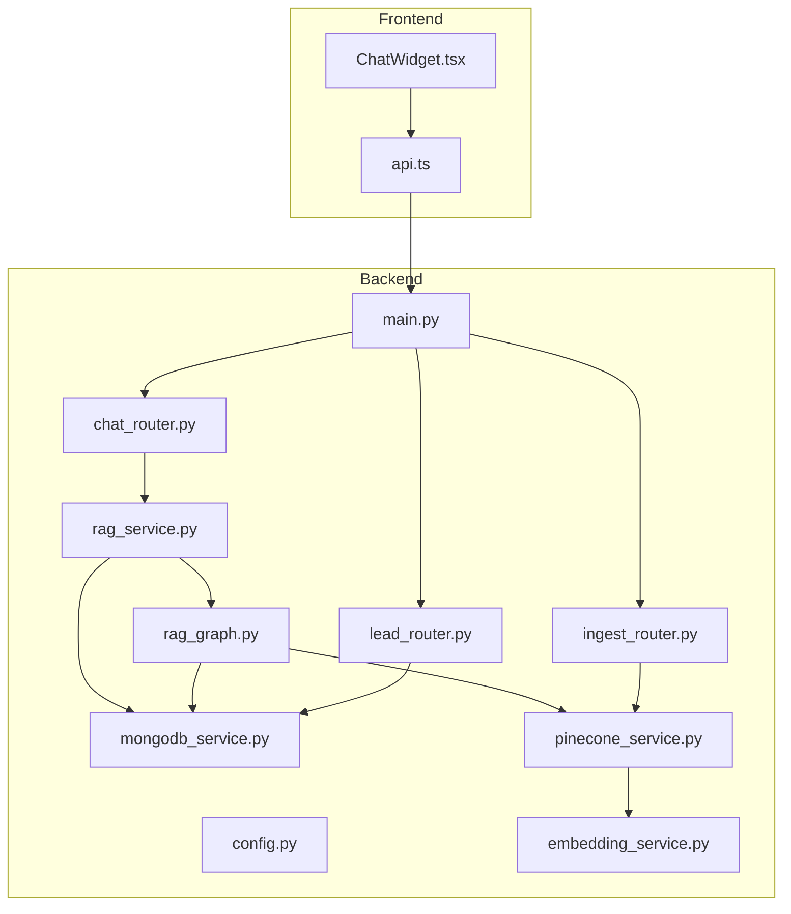
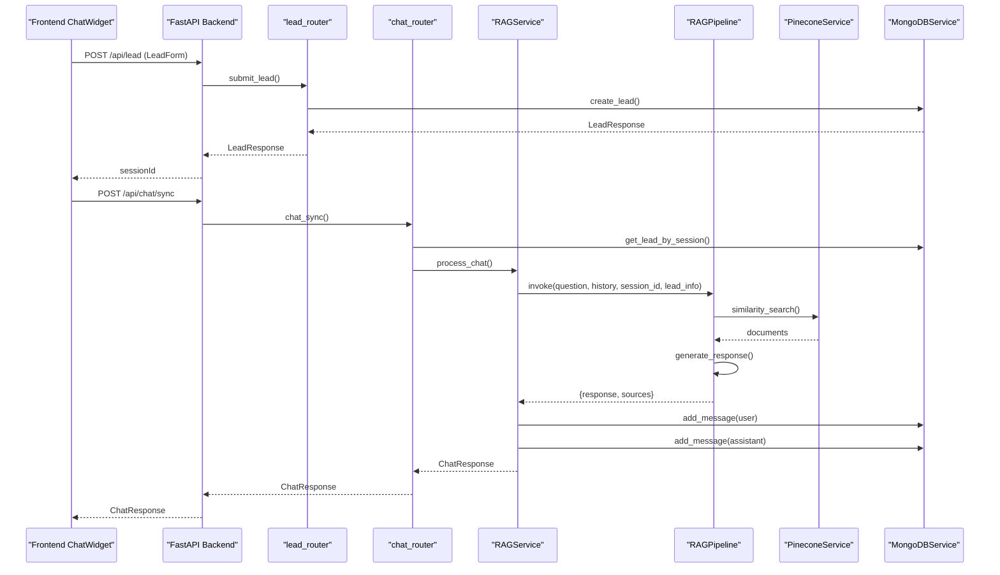

# Troubleshooting and FAQ

<cite>
**Referenced Files in This Document**
- [backend/app/main.py](file://backend/app/main.py)
- [backend/app/config.py](file://backend/app/config.py)
- [backend/app/routers/chat_router.py](file://backend/app/routers/chat_router.py)
- [backend/app/routers/lead_router.py](file://backend/app/routers/lead_router.py)
- [backend/app/routers/ingest_router.py](file://backend/app/routers/ingest_router.py)
- [backend/app/services/mongodb_service.py](file://backend/app/services/mongodb_service.py)
- [backend/app/services/pinecone_service.py](file://backend/app/services/pinecone_service.py)
- [backend/app/services/embedding_service.py](file://backend/app/services/embedding_service.py)
- [backend/app/services/rag_service.py](file://backend/app/services/rag_service.py)
- [backend/app/graph/rag_graph.py](file://backend/app/graph/rag_graph.py)
- [frontend/components/chat/ChatWidget.tsx](file://frontend/components/chat/ChatWidget.tsx)
- [frontend/lib/api.ts](file://frontend/lib/api.ts)
- [backend/requirements.txt](file://backend/requirements.txt)
- [frontend/package.json](file://frontend/package.json)
- [backend/vercel.json](file://backend/vercel.json)
</cite>

## Table of Contents
1. [Introduction](#introduction)
2. [Project Structure](#project-structure)
3. [Core Components](#core-components)
4. [Architecture Overview](#architecture-overview)
5. [Detailed Component Analysis](#detailed-component-analysis)
6. [Dependency Analysis](#dependency-analysis)
7. [Performance Considerations](#performance-considerations)
8. [Troubleshooting Guide](#troubleshooting-guide)
9. [Conclusion](#conclusion)
10. [Appendices](#appendices)

## Introduction
This document provides comprehensive troubleshooting guidance and FAQs for the Hitech RAG Chatbot. It covers common issues across API connectivity, database connections, vector database performance, and widget integration. It also includes debugging techniques for RAG pipeline failures, conversation memory issues, and lead capture problems, along with diagnostic procedures for system health monitoring, performance bottlenecks, error resolution, and deployment-related concerns such as environment configuration and cross-origin communication.

## Project Structure
The system comprises:
- Backend (FastAPI): Routers, services, configuration, and the LangGraph RAG pipeline.
- Frontend (Next.js): Chat widget, lead capture form, and API client.
- Vector store (Pinecone) and document store (MongoDB) integrated via services.
- Deployment configuration for serverless hosting.

**Diagram sources**
- [backend/app/main.py:1-90](file://backend/app/main.py#L1-L90)
- [backend/app/config.py:1-65](file://backend/app/config.py#L1-L65)
- [backend/app/routers/chat_router.py:1-130](file://backend/app/routers/chat_router.py#L1-L130)
- [backend/app/routers/lead_router.py:1-57](file://backend/app/routers/lead_router.py#L1-L57)
- [backend/app/routers/ingest_router.py:1-112](file://backend/app/routers/ingest_router.py#L1-L112)
- [backend/app/services/mongodb_service.py:1-202](file://backend/app/services/mongodb_service.py#L1-L202)
- [backend/app/services/pinecone_service.py:1-186](file://backend/app/services/pinecone_service.py#L1-L186)
- [backend/app/services/embedding_service.py:1-158](file://backend/app/services/embedding_service.py#L1-L158)
- [backend/app/services/rag_service.py:1-116](file://backend/app/services/rag_service.py#L1-L116)
- [backend/app/graph/rag_graph.py:1-264](file://backend/app/graph/rag_graph.py#L1-L264)
- [frontend/components/chat/ChatWidget.tsx:1-307](file://frontend/components/chat/ChatWidget.tsx#L1-L307)
- [frontend/lib/api.ts:1-93](file://frontend/lib/api.ts#L1-L93)

**Section sources**
- [backend/app/main.py:1-90](file://backend/app/main.py#L1-L90)
- [backend/app/config.py:1-65](file://backend/app/config.py#L1-L65)
- [frontend/components/chat/ChatWidget.tsx:1-307](file://frontend/components/chat/ChatWidget.tsx#L1-L307)
- [frontend/lib/api.ts:1-93](file://frontend/lib/api.ts#L1-L93)

## Core Components
- Configuration: Centralized environment-driven settings for MongoDB, Pinecone, Google Gemini, RAG parameters, session limits, scraping, and CORS.
- Routers: Expose endpoints for lead capture, chat, escalation, and knowledgebase ingestion/status/clear.
- Services:
  - MongoDB: Lead and conversation persistence, indexing, and cleanup.
  - Pinecone: Index initialization, upsert, similarity search, and stats.
  - Embedding: BGE-M3 model singleton for embeddings.
  - RAG: Orchestrates conversation history, LangGraph pipeline invocation, and response formatting.
- Graph: LangGraph workflow implementing retrieval, relevance grading, query transformation, and generation.
- Frontend: Chat widget with lead capture, message exchange, escalation, and local session storage.

**Section sources**
- [backend/app/config.py:1-65](file://backend/app/config.py#L1-L65)
- [backend/app/routers/lead_router.py:1-57](file://backend/app/routers/lead_router.py#L1-L57)
- [backend/app/routers/chat_router.py:1-130](file://backend/app/routers/chat_router.py#L1-L130)
- [backend/app/routers/ingest_router.py:1-112](file://backend/app/routers/ingest_router.py#L1-L112)
- [backend/app/services/mongodb_service.py:1-202](file://backend/app/services/mongodb_service.py#L1-L202)
- [backend/app/services/pinecone_service.py:1-186](file://backend/app/services/pinecone_service.py#L1-L186)
- [backend/app/services/embedding_service.py:1-158](file://backend/app/services/embedding_service.py#L1-L158)
- [backend/app/services/rag_service.py:1-116](file://backend/app/services/rag_service.py#L1-L116)
- [backend/app/graph/rag_graph.py:1-264](file://backend/app/graph/rag_graph.py#L1-L264)
- [frontend/components/chat/ChatWidget.tsx:1-307](file://frontend/components/chat/ChatWidget.tsx#L1-L307)
- [frontend/lib/api.ts:1-93](file://frontend/lib/api.ts#L1-L93)

## Architecture Overview
The chat flow integrates lead capture, conversation memory, and RAG retrieval with vector search and LLM generation.

**Diagram sources**
- [frontend/components/chat/ChatWidget.tsx:84-142](file://frontend/components/chat/ChatWidget.tsx#L84-L142)
- [frontend/lib/api.ts:61-85](file://frontend/lib/api.ts#L61-L85)
- [backend/app/routers/lead_router.py:11-44](file://backend/app/routers/lead_router.py#L11-L44)
- [backend/app/routers/chat_router.py:12-56](file://backend/app/routers/chat_router.py#L12-L56)
- [backend/app/services/rag_service.py:19-87](file://backend/app/services/rag_service.py#L19-L87)
- [backend/app/graph/rag_graph.py:221-251](file://backend/app/graph/rag_graph.py#L221-L251)
- [backend/app/services/pinecone_service.py:108-154](file://backend/app/services/pinecone_service.py#L108-L154)
- [backend/app/services/mongodb_service.py:51-133](file://backend/app/services/mongodb_service.py#L51-L133)

## Detailed Component Analysis

### API Connectivity and Health Monitoring
Common symptoms:
- Root endpoint returns unexpected status.
- Health endpoint reports disconnected services.
- Frontend requests fail with network errors.

Diagnostic steps:
- Verify backend root and health endpoints are reachable.
- Confirm CORS configuration allows the frontend origin.
- Check environment variables for backend URL and API keys.

Key references:
- Root and health endpoints, CORS middleware, and service initialization lifecycle.
- Environment variables for backend URL and CORS origins.
- Frontend API base URL and request types.

**Section sources**
- [backend/app/main.py:64-83](file://backend/app/main.py#L64-L83)
- [backend/app/main.py:50-57](file://backend/app/main.py#L50-L57)
- [backend/app/config.py:13-13](file://backend/app/config.py#L13-L13)
- [backend/app/config.py:47-58](file://backend/app/config.py#L47-L58)
- [frontend/lib/api.ts:4-4](file://frontend/lib/api.ts#L4-L4)
- [frontend/lib/api.ts:61-85](file://frontend/lib/api.ts#L61-L85)

### Database Connection Failures (MongoDB)
Symptoms:
- Lead creation fails.
- Chat sync returns session not found.
- Conversation retrieval returns not found.
- Escalation does not mark conversation.

Root causes:
- Incorrect MongoDB URI or credentials.
- Database not reachable or index creation failing.
- Missing or expired session ID.

Resolution:
- Validate MONGODB_URI and database name.
- Ensure indexes exist after startup.
- Confirm session ID is present and not expired.

**Section sources**
- [backend/app/main.py:21-28](file://backend/app/main.py#L21-L28)
- [backend/app/services/mongodb_service.py:21-48](file://backend/app/services/mongodb_service.py#L21-L48)
- [backend/app/services/mongodb_service.py:51-94](file://backend/app/services/mongodb_service.py#L51-L94)
- [backend/app/routers/chat_router.py:28-34](file://backend/app/routers/chat_router.py#L28-L34)
- [backend/app/routers/chat_router.py:120-129](file://backend/app/routers/chat_router.py#L120-L129)

### Vector Database Performance Issues (Pinecone)
Symptoms:
- Retrieval returns no documents or low-relevance results.
- Similarity search timeouts or errors.
- Ingestion slow or failing.

Root causes:
- Missing or uninitialized index.
- Incorrect Pinecone API key or environment.
- Low similarity threshold or insufficient top_k.
- Large vector dimensionality or index fullness.

Resolution:
- Ensure Pinecone index exists and is initialized during startup.
- Verify API key, environment, and index name.
- Adjust RAG_TOP_K and RAG_SIMILARITY_THRESHOLD.
- Monitor index statistics and clear/rebuild if needed.

**Section sources**
- [backend/app/main.py:24-25](file://backend/app/main.py#L24-L25)
- [backend/app/services/pinecone_service.py:27-55](file://backend/app/services/pinecone_service.py#L27-L55)
- [backend/app/services/pinecone_service.py:108-154](file://backend/app/services/pinecone_service.py#L108-L154)
- [backend/app/graph/rag_graph.py:75-91](file://backend/app/graph/rag_graph.py#L75-L91)
- [backend/app/routers/ingest_router.py:76-92](file://backend/app/routers/ingest_router.py#L76-L92)

### Widget Integration Problems
Symptoms:
- Lead form does not submit.
- Messages do not appear or error appears.
- “Talk to Human” escalation fails.
- Session not persisted locally.

Root causes:
- Incorrect NEXT_PUBLIC_API_URL.
- CORS misconfiguration blocking the widget.
- Local storage quota exceeded or blocked.
- Widget embedded mode not passing session ID.

Resolution:
- Set NEXT_PUBLIC_API_URL to the backend base URL.
- Configure CORS origins to include the frontend origin.
- Clear browser cache/local storage if corrupted.
- Ensure embedded mode passes session ID to all requests.

**Section sources**
- [frontend/lib/api.ts:4-4](file://frontend/lib/api.ts#L4-L4)
- [frontend/components/chat/ChatWidget.tsx:84-108](file://frontend/components/chat/ChatWidget.tsx#L84-L108)
- [frontend/components/chat/ChatWidget.tsx:110-142](file://frontend/components/chat/ChatWidget.tsx#L110-L142)
- [frontend/components/chat/ChatWidget.tsx:144-170](file://frontend/components/chat/ChatWidget.tsx#L144-L170)
- [frontend/components/chat/ChatWidget.tsx:38-82](file://frontend/components/chat/ChatWidget.tsx#L38-L82)
- [backend/app/main.py:50-57](file://backend/app/main.py#L50-L57)

### RAG Pipeline Failures
Symptoms:
- Empty or irrelevant answers.
- Generation errors or timeouts.
- Query transformation loops or retries exhausted.

Root causes:
- No relevant documents retrieved.
- LLM API key missing or invalid.
- Conversation history not passed correctly.
- Threshold filtering removes all documents.

Resolution:
- Increase RAG_TOP_K and adjust RAG_SIMILARITY_THRESHOLD.
- Verify GEMINI_API_KEY and model settings.
- Ensure conversation history is populated and recent messages are included.
- Inspect query transformation logic and retry limits.

**Section sources**
- [backend/app/services/rag_service.py:19-87](file://backend/app/services/rag_service.py#L19-L87)
- [backend/app/graph/rag_graph.py:221-251](file://backend/app/graph/rag_graph.py#L221-L251)
- [backend/app/graph/rag_graph.py:71-120](file://backend/app/graph/rag_graph.py#L71-L120)
- [backend/app/graph/rag_graph.py:150-219](file://backend/app/graph/rag_graph.py#L150-L219)
- [backend/app/config.py:25-30](file://backend/app/config.py#L25-L30)

### Conversation Memory Issues
Symptoms:
- Responses lack context.
- Repeated questions not understood.
- Escalation summary incomplete.

Root causes:
- MAX_CONVERSATION_HISTORY too low.
- Messages not stored after processing.
- get_conversation_history returns empty.

Resolution:
- Increase MAX_CONVERSATION_HISTORY.
- Verify add_message operations succeed.
- Confirm get_conversation exists and contains messages.

**Section sources**
- [backend/app/config.py:38-39](file://backend/app/config.py#L38-L39)
- [backend/app/services/rag_service.py:30-67](file://backend/app/services/rag_service.py#L30-L67)
- [backend/app/services/mongodb_service.py:135-145](file://backend/app/services/mongodb_service.py#L135-L145)
- [backend/app/routers/chat_router.py:120-129](file://backend/app/routers/chat_router.py#L120-L129)

### Lead Capture Problems
Symptoms:
- Duplicate sessions not reused.
- Lead creation fails.
- Session ID missing from responses.

Root causes:
- Email already exists but not matched.
- Database write failure.
- Missing session ID in response.

Resolution:
- Check get_lead_by_email logic and uniqueness constraints.
- Validate LeadCreate payload.
- Ensure session ID is returned and stored in local storage.

**Section sources**
- [backend/app/routers/lead_router.py:24-44](file://backend/app/routers/lead_router.py#L24-L44)
- [backend/app/services/mongodb_service.py:51-77](file://backend/app/services/mongodb_service.py#L51-L77)
- [frontend/components/chat/ChatWidget.tsx:84-108](file://frontend/components/chat/ChatWidget.tsx#L84-L108)

### Knowledgebase Ingestion and Maintenance
Symptoms:
- Ingestion returns warning for no pages.
- Status endpoint fails.
- Clear operation does not remove vectors.

Root causes:
- Invalid URL or robots restrictions.
- Pinecone upsert errors.
- Index not initialized.

Resolution:
- Verify base URL and max_pages.
- Check Pinecone upsert response and batch sizes.
- Ensure index exists and is connected.

**Section sources**
- [backend/app/routers/ingest_router.py:26-73](file://backend/app/routers/ingest_router.py#L26-L73)
- [backend/app/routers/ingest_router.py:76-92](file://backend/app/routers/ingest_router.py#L76-L92)
- [backend/app/routers/ingest_router.py:95-111](file://backend/app/routers/ingest_router.py#L95-L111)
- [backend/app/services/pinecone_service.py:108-154](file://backend/app/services/pinecone_service.py#L108-L154)

## Dependency Analysis
External dependencies and their roles:
- FastAPI and Uvicorn for the backend server.
- Motor/Pymongo for asynchronous MongoDB access.
- Pinecone client for vector operations.
- LangChain/LangGraph for RAG orchestration.
- FlagEmbedding/BGE-M3 for embeddings.
- Axios for frontend HTTP requests.
- Next.js for frontend runtime and build.

Potential issues:
- Version mismatches in LangChain/LangGraph.
- Embedding model loading failures on CPU-only environments.
- Pinecone rate limits or index quotas.
- CORS misconfiguration causing preflight failures.

**Section sources**
- [backend/requirements.txt:1-48](file://backend/requirements.txt#L1-L48)
- [frontend/package.json:1-37](file://frontend/package.json#L1-L37)
- [backend/app/services/embedding_service.py:29-48](file://backend/app/services/embedding_service.py#L29-L48)
- [backend/app/services/pinecone_service.py:32-55](file://backend/app/services/pinecone_service.py#L32-L55)
- [backend/app/main.py:50-57](file://backend/app/main.py#L50-L57)

## Performance Considerations
- RAG_TOP_K and RAG_SIMILARITY_THRESHOLD directly impact latency and relevance.
- Chunk size and overlap influence embedding quality and retrieval speed.
- Embedding batch size affects throughput; tune for available resources.
- Pinecone index statistics inform capacity planning.
- Frontend caching of session data reduces repeated requests.

[No sources needed since this section provides general guidance]

## Troubleshooting Guide

### Quick Checks
- Backend health: GET /api/health to confirm MongoDB and Pinecone statuses.
- CORS: Ensure frontend origin is in CORS_ORIGINS.
- Environment: Validate all API keys and URLs in .env.

**Section sources**
- [backend/app/main.py:74-83](file://backend/app/main.py#L74-L83)
- [backend/app/config.py:47-58](file://backend/app/config.py#L47-L58)

### API Connectivity
- Symptom: Frontend receives network errors or CORS errors.
- Actions:
  - Confirm NEXT_PUBLIC_API_URL matches backend base URL.
  - Verify CORS_ORIGINS includes the frontend origin.
  - Test /api/health from the frontend domain.

**Section sources**
- [frontend/lib/api.ts:4-4](file://frontend/lib/api.ts#L4-L4)
- [backend/app/main.py:50-57](file://backend/app/main.py#L50-L57)
- [backend/app/main.py:74-83](file://backend/app/main.py#L74-L83)

### Database Connectivity
- Symptom: Lead creation or chat sync fails.
- Actions:
  - Check MONGODB_URI and database name.
  - Verify indexes created on startup.
  - Confirm session ID presence in requests.

**Section sources**
- [backend/app/main.py:21-28](file://backend/app/main.py#L21-L28)
- [backend/app/services/mongodb_service.py:21-48](file://backend/app/services/mongodb_service.py#L21-L48)
- [backend/app/routers/chat_router.py:28-34](file://backend/app/routers/chat_router.py#L28-L34)

### Vector Database Connectivity
- Symptom: Retrieval returns no results or errors.
- Actions:
  - Confirm PINECONE_API_KEY and environment.
  - Ensure index exists and is initialized.
  - Adjust similarity threshold and top_k.

**Section sources**
- [backend/app/main.py:24-25](file://backend/app/main.py#L24-L25)
- [backend/app/services/pinecone_service.py:27-55](file://backend/app/services/pinecone_service.py#L27-L55)
- [backend/app/graph/rag_graph.py:75-91](file://backend/app/graph/rag_graph.py#L75-L91)

### RAG Pipeline Debugging
- Symptom: Poor or missing answers.
- Actions:
  - Increase RAG_TOP_K and lower threshold cautiously.
  - Verify conversation history is passed.
  - Inspect query transformation and retries.

**Section sources**
- [backend/app/services/rag_service.py:30-48](file://backend/app/services/rag_service.py#L30-L48)
- [backend/app/graph/rag_graph.py:110-120](file://backend/app/graph/rag_graph.py#L110-L120)
- [backend/app/graph/rag_graph.py:221-251](file://backend/app/graph/rag_graph.py#L221-L251)

### Conversation Memory Issues
- Symptom: Context loss or escalation summary incomplete.
- Actions:
  - Increase MAX_CONVERSATION_HISTORY.
  - Ensure add_message succeeds for both user and assistant.
  - Retrieve conversation to verify messages.

**Section sources**
- [backend/app/config.py:38-39](file://backend/app/config.py#L38-L39)
- [backend/app/services/mongodb_service.py:117-133](file://backend/app/services/mongodb_service.py#L117-L133)
- [backend/app/routers/chat_router.py:120-129](file://backend/app/routers/chat_router.py#L120-L129)

### Lead Capture Problems
- Symptom: New session created each visit or session not reused.
- Actions:
  - Check email uniqueness and get_lead_by_email.
  - Validate LeadCreate payload.
  - Confirm session ID stored in local storage.

**Section sources**
- [backend/app/routers/lead_router.py:24-44](file://backend/app/routers/lead_router.py#L24-L44)
- [frontend/components/chat/ChatWidget.tsx:38-82](file://frontend/components/chat/ChatWidget.tsx#L38-L82)

### Knowledgebase Ingestion
- Symptom: Ingestion warning or status failure.
- Actions:
  - Verify URL and max_pages.
  - Check Pinecone upsert response.
  - Use clear endpoint to reset index if needed.

**Section sources**
- [backend/app/routers/ingest_router.py:26-73](file://backend/app/routers/ingest_router.py#L26-L73)
- [backend/app/routers/ingest_router.py:76-92](file://backend/app/routers/ingest_router.py#L76-L92)
- [backend/app/routers/ingest_router.py:95-111](file://backend/app/routers/ingest_router.py#L95-L111)

### System Health Monitoring
- Use /api/health to monitor service statuses.
- Track Pinecone stats endpoint for vector counts and fullness.
- Log backend startup/shutdown events for lifecycle issues.

**Section sources**
- [backend/app/main.py:74-83](file://backend/app/main.py#L74-L83)
- [backend/app/routers/ingest_router.py:76-92](file://backend/app/routers/ingest_router.py#L76-L92)

### Error Codes and Log Analysis
- HTTP 404: Session not found or conversation not found.
- HTTP 404: Lead not found.
- HTTP 500: General processing or ingestion errors.
- Logs: Startup/connect/disconnect messages and pipeline prints.

**Section sources**
- [backend/app/routers/chat_router.py:31-34](file://backend/app/routers/chat_router.py#L31-L34)
- [backend/app/routers/chat_router.py:127-128](file://backend/app/routers/chat_router.py#L127-L128)
- [backend/app/routers/lead_router.py:54-56](file://backend/app/routers/lead_router.py#L54-L56)
- [backend/app/main.py:18-36](file://backend/app/main.py#L18-L36)
- [backend/app/graph/rag_graph.py:71-91](file://backend/app/graph/rag_graph.py#L71-L91)

### Deployment and Environment Configuration
- Vercel configuration routes all paths to main.py.
- PYTHONPATH configured for module resolution.
- Ensure environment variables are set in the platform.

**Section sources**
- [backend/vercel.json:1-22](file://backend/vercel.json#L1-L22)

### Cross-Origin Communication
- Configure CORS_ORIGINS to include frontend domains.
- Allow credentials and required headers.
- Test preflight OPTIONS requests.

**Section sources**
- [backend/app/main.py:50-57](file://backend/app/main.py#L50-L57)
- [backend/app/config.py:47-58](file://backend/app/config.py#L47-L58)

### Preventive Measures and Maintenance
- Regularly monitor /api/health and Pinecone stats.
- Periodic cleanup of expired sessions.
- Validate ingestion pipeline after content updates.
- Keep embedding and LLM libraries updated per requirements.

**Section sources**
- [backend/app/main.py:74-83](file://backend/app/main.py#L74-L83)
- [backend/app/services/mongodb_service.py:182-192](file://backend/app/services/mongodb_service.py#L182-L192)
- [backend/requirements.txt:1-48](file://backend/requirements.txt#L1-L48)

### Escalation Procedures for Critical Issues
- If health endpoint reports disconnected services, restart backend and re-run initialization.
- If vector store is degraded, clear and re-ingest knowledgebase.
- If widget fails across domains, review CORS configuration and frontend base URL.

**Section sources**
- [backend/app/main.py:74-83](file://backend/app/main.py#L74-L83)
- [backend/app/routers/ingest_router.py:95-111](file://backend/app/routers/ingest_router.py#L95-L111)
- [backend/app/main.py:50-57](file://backend/app/main.py#L50-L57)

## Conclusion
This guide consolidates actionable diagnostics and resolutions for the Hitech RAG Chatbot across API connectivity, database and vector store reliability, RAG pipeline robustness, and frontend integration. By following the structured troubleshooting steps, adjusting configuration parameters, and monitoring health endpoints, most operational issues can be resolved quickly and efficiently.

## Appendices

### Diagnostic Checklist
- Backend health: /api/health
- Frontend base URL: NEXT_PUBLIC_API_URL
- CORS origins: CORS_ORIGINS
- MongoDB: URI, indexes, session existence
- Pinecone: API key, index existence, stats
- RAG: top_k, threshold, history length
- Ingestion: URL, pages scraped, chunks created

**Section sources**
- [backend/app/main.py:74-83](file://backend/app/main.py#L74-L83)
- [frontend/lib/api.ts:4-4](file://frontend/lib/api.ts#L4-L4)
- [backend/app/config.py:47-58](file://backend/app/config.py#L47-L58)
- [backend/app/services/mongodb_service.py:21-48](file://backend/app/services/mongodb_service.py#L21-L48)
- [backend/app/services/pinecone_service.py:27-55](file://backend/app/services/pinecone_service.py#L27-L55)
- [backend/app/graph/rag_graph.py:75-91](file://backend/app/graph/rag_graph.py#L75-L91)
- [backend/app/routers/ingest_router.py:26-73](file://backend/app/routers/ingest_router.py#L26-L73)