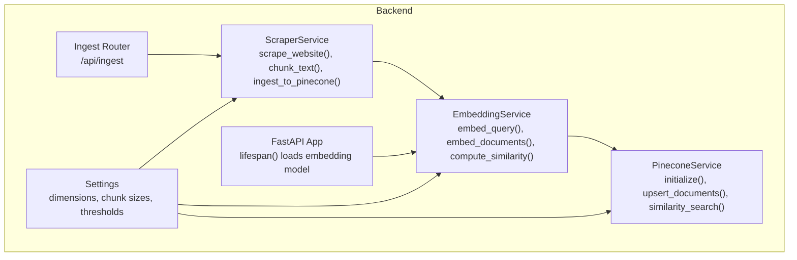
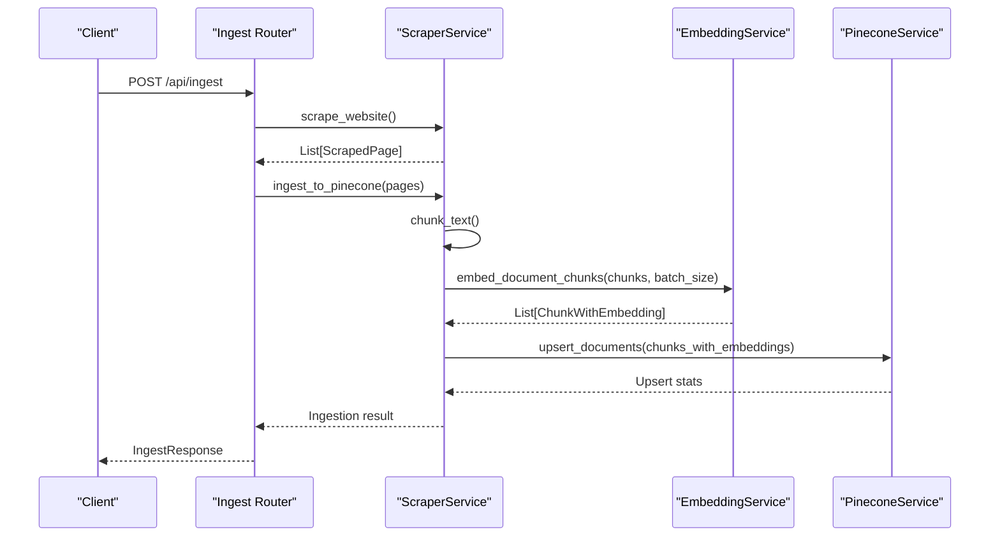
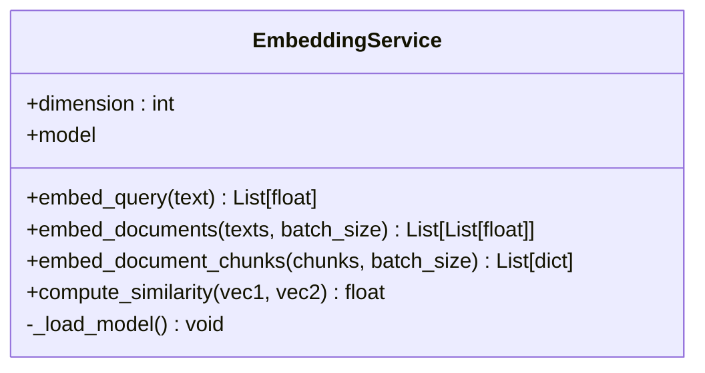
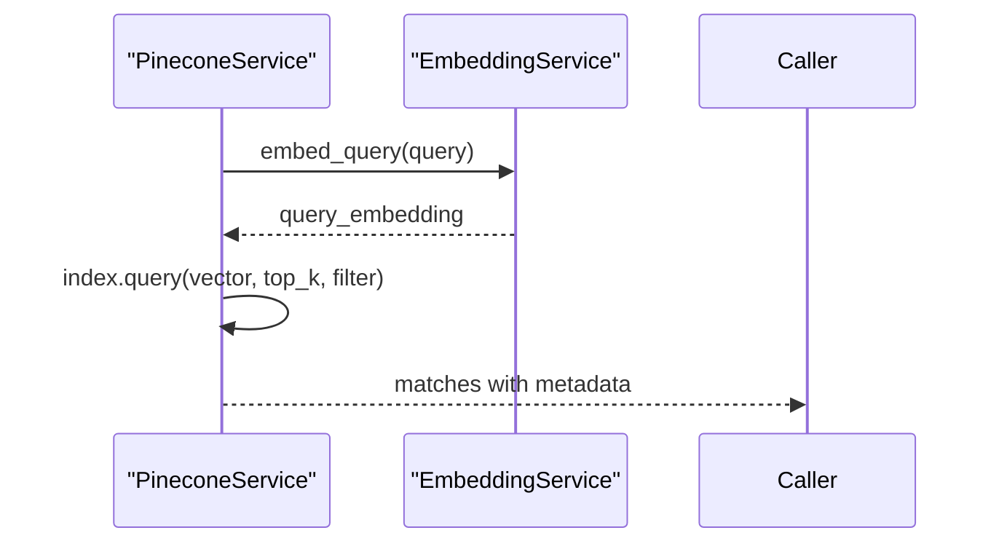
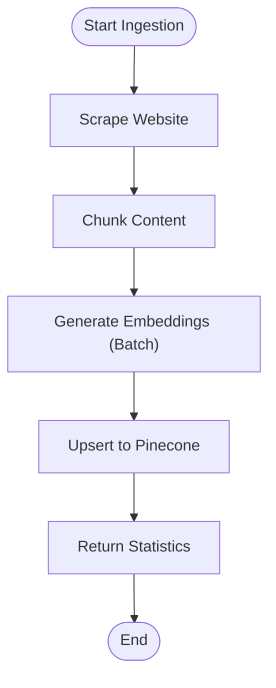
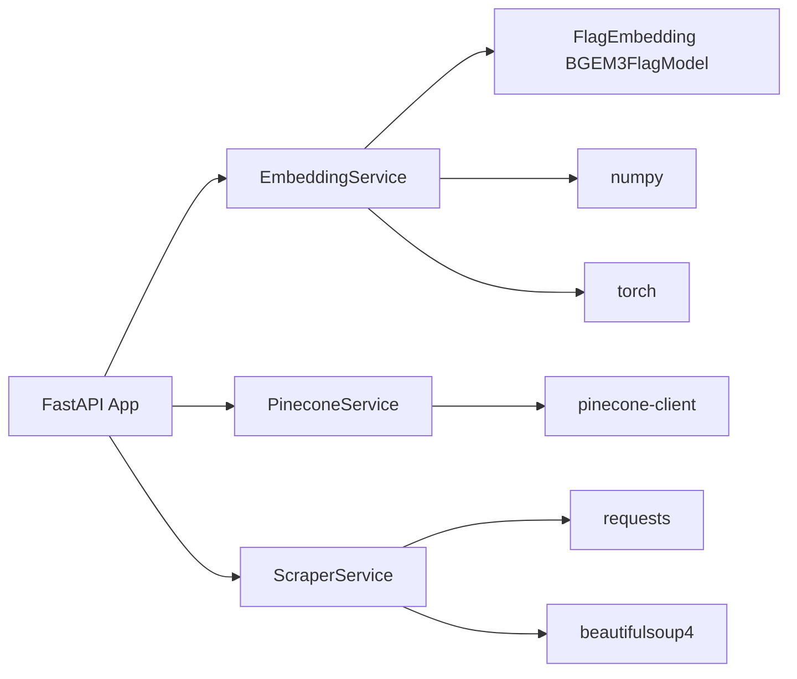

# Embedding Generation

<cite>
**Referenced Files in This Document**
- [embedding_service.py](file://backend/app/services/embedding_service.py)
- [config.py](file://backend/app/config.py)
- [main.py](file://backend/app/main.py)
- [pinecone_service.py](file://backend/app/services/pinecone_service.py)
- [scraper_service.py](file://backend/app/services/scraper_service.py)
- [ingest_router.py](file://backend/app/routers/ingest_router.py)
- [requirements.txt](file://backend/requirements.txt)
</cite>

## Table of Contents
1. [Introduction](#introduction)
2. [Project Structure](#project-structure)
3. [Core Components](#core-components)
4. [Architecture Overview](#architecture-overview)
5. [Detailed Component Analysis](#detailed-component-analysis)
6. [Dependency Analysis](#dependency-analysis)
7. [Performance Considerations](#performance-considerations)
8. [Troubleshooting Guide](#troubleshooting-guide)
9. [Conclusion](#conclusion)
10. [Appendices](#appendices)

## Introduction
This document explains the embedding generation system powered by the BGE-M3 model (1024 dimensions). It covers service configuration, model initialization, text preprocessing, batch processing, cosine similarity computation, and integration with the vector store and ingestion pipeline. It also provides guidance on error handling, performance tuning, and troubleshooting for large-scale document ingestion.

## Project Structure
The embedding system spans several backend modules:
- Embedding service encapsulates model loading and embedding generation
- Configuration centralizes dimension and RAG parameters
- Pinecone service integrates embeddings with a vector store
- Scraper service prepares and chunks content for embedding
- Ingestion router orchestrates the end-to-end ingestion workflow

**Diagram sources**
- [embedding_service.py:10-158](file://backend/app/services/embedding_service.py#L10-L158)
- [config.py:7-65](file://backend/app/config.py#L7-L65)
- [pinecone_service.py:10-186](file://backend/app/services/pinecone_service.py#L10-L186)
- [scraper_service.py:26-329](file://backend/app/services/scraper_service.py#L26-L329)
- [ingest_router.py:26-112](file://backend/app/routers/ingest_router.py#L26-L112)
- [main.py:14-37](file://backend/app/main.py#L14-L37)

**Section sources**
- [embedding_service.py:10-158](file://backend/app/services/embedding_service.py#L10-L158)
- [config.py:7-65](file://backend/app/config.py#L7-L65)
- [pinecone_service.py:10-186](file://backend/app/services/pinecone_service.py#L10-L186)
- [scraper_service.py:26-329](file://backend/app/services/scraper_service.py#L26-L329)
- [ingest_router.py:26-112](file://backend/app/routers/ingest_router.py#L26-L112)
- [main.py:14-37](file://backend/app/main.py#L14-L37)

## Core Components
- EmbeddingService: Singleton that loads BGE-M3, generates embeddings for queries and documents, and computes cosine similarity.
- Settings: Centralized configuration including embedding dimension (1024), chunk sizes, and similarity thresholds.
- PineconeService: Manages Pinecone index creation, upsert, and similarity search using cosine distance.
- ScraperService: Extracts, cleans, and chunks content; integrates embedding generation and vector store upsert.
- Ingest Router: Exposes endpoints to trigger ingestion and check status.

Key embedding dimension and similarity configuration:
- Embedding dimension: 1024 (BGE-M3)
- Similarity threshold: configurable via settings
- Chunk size and overlap: configurable via settings

**Section sources**
- [embedding_service.py:22-28](file://backend/app/services/embedding_service.py#L22-L28)
- [config.py:23](file://backend/app/config.py#L23)
- [config.py:33](file://backend/app/config.py#L33)
- [config.py:34](file://backend/app/config.py#L34)
- [config.py:35](file://backend/app/config.py#L35)

## Architecture Overview
The embedding pipeline integrates scraping, chunking, embedding generation, and vector storage:

**Diagram sources**
- [ingest_router.py:26-74](file://backend/app/routers/ingest_router.py#L26-L74)
- [scraper_service.py:250-306](file://backend/app/services/scraper_service.py#L250-L306)
- [embedding_service.py:106-126](file://backend/app/services/embedding_service.py#L106-L126)
- [pinecone_service.py:62-106](file://backend/app/services/pinecone_service.py#L62-L106)

## Detailed Component Analysis

### EmbeddingService
Responsibilities:
- Singleton model loader for BGE-M3 (CPU, FP32)
- Query embedding with instruction prefixing for retrieval
- Batch document embedding with filtering of empty texts
- Chunk embedding with metadata injection
- Cosine similarity computation

Implementation highlights:
- Model initialization uses FlagEmbedding BGEM3FlagModel with CPU device and FP32 precision
- Query embedding wraps input with a retrieval instruction
- Batch processing uses configurable batch_size with max_length support
- Similarity uses L2 norms and dot product normalization

**Diagram sources**
- [embedding_service.py:10-158](file://backend/app/services/embedding_service.py#L10-L158)

**Section sources**
- [embedding_service.py:29-48](file://backend/app/services/embedding_service.py#L29-L48)
- [embedding_service.py:55-77](file://backend/app/services/embedding_service.py#L55-L77)
- [embedding_service.py:79-104](file://backend/app/services/embedding_service.py#L79-L104)
- [embedding_service.py:106-126](file://backend/app/services/embedding_service.py#L106-L126)
- [embedding_service.py:128-148](file://backend/app/services/embedding_service.py#L128-L148)

### Settings and Dimensions
- Embedding dimension is set to 1024 (BGE-M3)
- Similarity threshold controls relevance cutoff
- Chunk size and overlap control segmentation granularity

**Section sources**
- [config.py:23](file://backend/app/config.py#L23)
- [config.py:33](file://backend/app/config.py#L33)
- [config.py:34](file://backend/app/config.py#L34)
- [config.py:35](file://backend/app/config.py#L35)

### PineconeService Integration
- Ensures index exists with cosine metric and 1024 dimension
- Upserts vectors with metadata and batches
- Performs similarity search using query embeddings

**Diagram sources**
- [pinecone_service.py:108-154](file://backend/app/services/pinecone_service.py#L108-L154)
- [embedding_service.py:55-77](file://backend/app/services/embedding_service.py#L55-L77)

**Section sources**
- [pinecone_service.py:27-55](file://backend/app/services/pinecone_service.py#L27-L55)
- [pinecone_service.py:62-106](file://backend/app/services/pinecone_service.py#L62-L106)
- [pinecone_service.py:108-154](file://backend/app/services/pinecone_service.py#L108-L154)

### ScraperService and Ingestion Pipeline
- Scrapes pages, extracts content, cleans text, and chunks
- Generates embeddings in batches and upserts to Pinecone
- Provides ingestion status and clearing endpoints

**Diagram sources**
- [scraper_service.py:195-248](file://backend/app/services/scraper_service.py#L195-L248)
- [scraper_service.py:250-306](file://backend/app/services/scraper_service.py#L250-L306)
- [embedding_service.py:79-104](file://backend/app/services/embedding_service.py#L79-L104)
- [pinecone_service.py:62-106](file://backend/app/services/pinecone_service.py#L62-L106)

**Section sources**
- [scraper_service.py:164-194](file://backend/app/services/scraper_service.py#L164-L194)
- [scraper_service.py:250-306](file://backend/app/services/scraper_service.py#L250-L306)
- [ingest_router.py:26-74](file://backend/app/routers/ingest_router.py#L26-L74)

## Dependency Analysis
External libraries and their roles:
- FlagEmbedding: BGE-M3 model wrapper
- torch: tensor operations and model inference
- numpy: numerical operations for similarity
- pinecone-client: vector store operations
- fastapi: orchestration and lifecycle management

**Diagram sources**
- [requirements.txt:23-26](file://backend/requirements.txt#L23-L26)
- [requirements.txt:13-14](file://backend/requirements.txt#L13-L14)
- [requirements.txt:28-31](file://backend/requirements.txt#L28-L31)
- [embedding_service.py:32-41](file://backend/app/services/embedding_service.py#L32-L41)
- [main.py:14-28](file://backend/app/main.py#L14-L28)

**Section sources**
- [requirements.txt:23-26](file://backend/requirements.txt#L23-L26)
- [requirements.txt:13-14](file://backend/requirements.txt#L13-L14)
- [requirements.txt:28-31](file://backend/requirements.txt#L28-L31)
- [embedding_service.py:32-41](file://backend/app/services/embedding_service.py#L32-L41)
- [main.py:14-28](file://backend/app/main.py#L14-L28)

## Performance Considerations
- Model device and precision: CPU with FP32 ensures compatibility and stability for serverless deployments
- Batch sizing: Default batch_size is tuned for throughput; adjust based on memory constraints
- Text length: Max length is configured to handle long documents
- Index metric: Pinecone uses cosine metric for similarity search
- Memory optimization: Singleton embedding model prevents repeated loading; batch processing reduces overhead

[No sources needed since this section provides general guidance]

## Troubleshooting Guide
Common issues and resolutions:
- Model load failure: Verify FlagEmbedding installation and environment; the service raises a runtime error on failure
- Empty text handling: Queries and documents are validated; ensure non-empty inputs
- Similarity edge cases: Zero-norm vectors return zero similarity; ensure embeddings are non-zero
- Ingestion errors: Scraper validates content length and filters invalid URLs; check logs for scraping exceptions
- Vector store connectivity: Ensure Pinecone API key and index configuration are correct

**Section sources**
- [embedding_service.py:45-48](file://backend/app/services/embedding_service.py#L45-L48)
- [embedding_service.py:65-66](file://backend/app/services/embedding_service.py#L65-L66)
- [embedding_service.py:90-96](file://backend/app/services/embedding_service.py#L90-L96)
- [embedding_service.py:145-146](file://backend/app/services/embedding_service.py#L145-L146)
- [scraper_service.py:267-268](file://backend/app/services/scraper_service.py#L267-L268)
- [scraper_service.py:160-162](file://backend/app/services/scraper_service.py#L160-L162)
- [pinecone_service.py:33](file://backend/app/services/pinecone_service.py#L33)

## Conclusion
The embedding generation system leverages BGE-M3 with a robust pipeline from scraping to vector storage. The EmbeddingService provides efficient batch processing, cosine similarity, and integration with Pinecone. Proper configuration of dimensions, chunking, and batch sizes ensures scalable performance for large document sets.

[No sources needed since this section summarizes without analyzing specific files]

## Appendices

### Embedding Generation Workflows
- Single query embedding: wrap with retrieval instruction, encode with model, return dense vector
- Batch document embedding: filter empty texts, encode in batches, return dense vectors
- Chunk embedding with metadata: extract content, embed, attach embedding to chunk dictionary

**Section sources**
- [embedding_service.py:55-77](file://backend/app/services/embedding_service.py#L55-L77)
- [embedding_service.py:79-104](file://backend/app/services/embedding_service.py#L79-L104)
- [embedding_service.py:106-126](file://backend/app/services/embedding_service.py#L106-L126)

### Error Handling for Failed Embeddings
- Validation: empty queries raise ValueError
- Model load: exceptions are logged and surfaced as runtime errors
- Similarity: zero-norm vectors return zero similarity

**Section sources**
- [embedding_service.py:65-66](file://backend/app/services/embedding_service.py#L65-L66)
- [embedding_service.py:45-48](file://backend/app/services/embedding_service.py#L45-L48)
- [embedding_service.py:145-146](file://backend/app/services/embedding_service.py#L145-L146)

### Optimization Strategies for Large Document Sets
- Adjust batch_size to balance throughput and memory usage
- Increase max_length for long documents
- Use chunk_size and overlap to control granularity
- Monitor Pinecone upsert batch sizes and index statistics

**Section sources**
- [embedding_service.py:79-104](file://backend/app/services/embedding_service.py#L79-L104)
- [scraper_service.py:164-194](file://backend/app/services/scraper_service.py#L164-L194)
- [pinecone_service.py:62-106](file://backend/app/services/pinecone_service.py#L62-L106)

### Embedding Quality Metrics and Dimension Reduction
- Quality metrics: cosine similarity threshold and top-k retrieval results
- Dimensionality: fixed at 1024 (BGE-M3); no explicit dimension reduction is implemented
- Recommendations: tune similarity threshold and chunking parameters based on evaluation

**Section sources**
- [config.py:33](file://backend/app/config.py#L33)
- [config.py:34](file://backend/app/config.py#L34)
- [config.py:23](file://backend/app/config.py#L23)