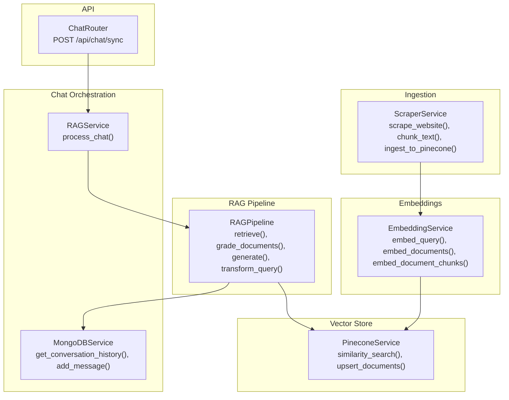
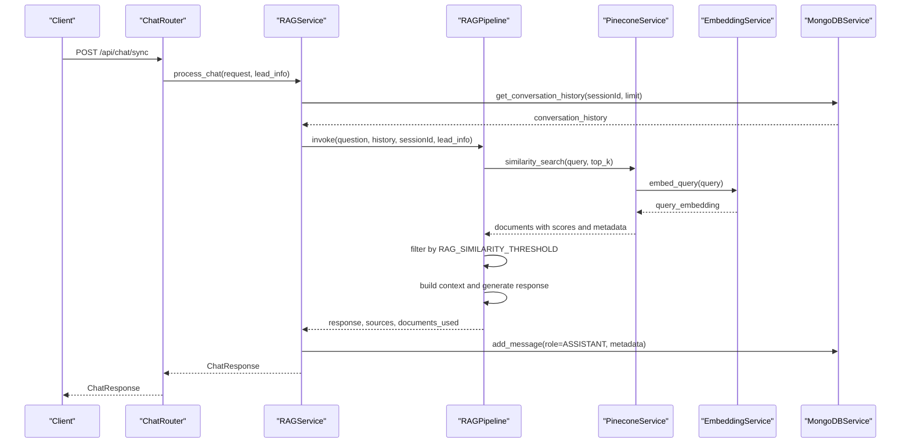
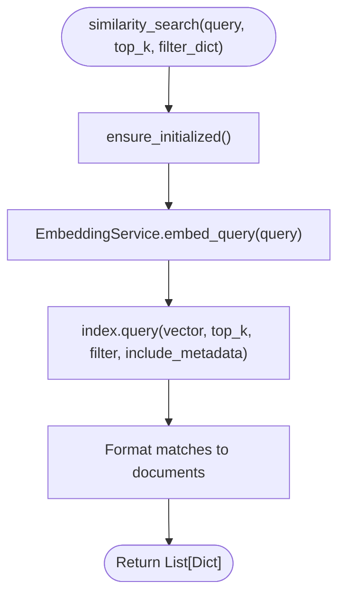
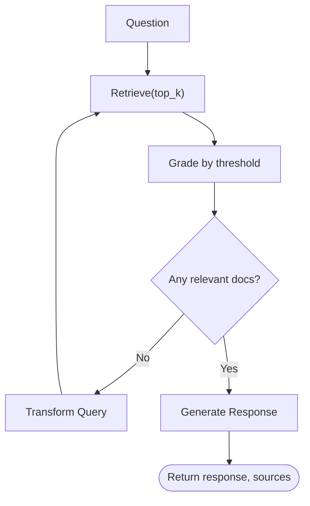
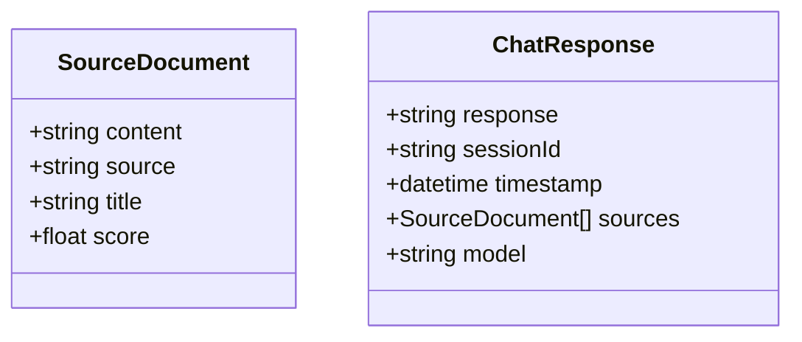
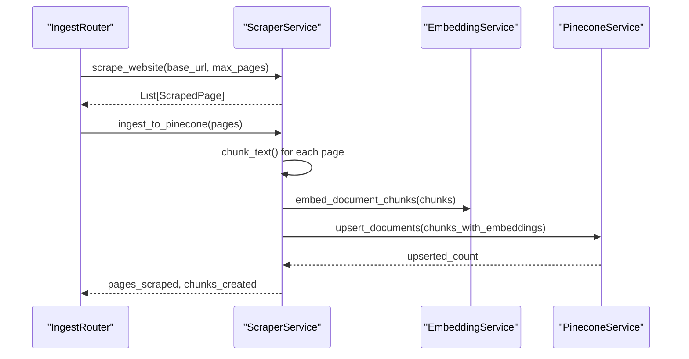
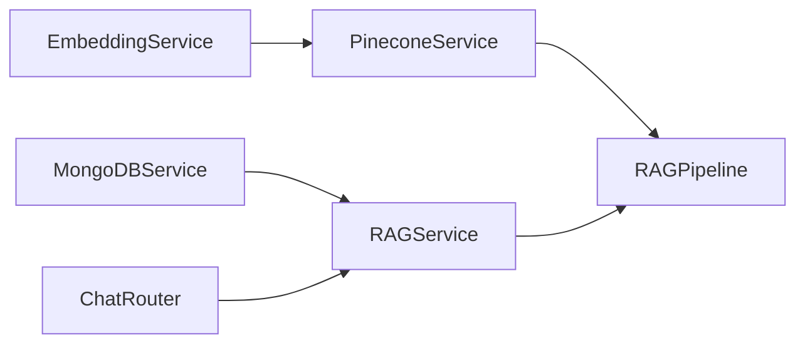

# Similarity Search and Retrieval

<cite>
**Referenced Files in This Document**
- [pinecone_service.py](file://backend/app/services/pinecone_service.py)
- [embedding_service.py](file://backend/app/services/embedding_service.py)
- [rag_graph.py](file://backend/app/graph/rag_graph.py)
- [rag_service.py](file://backend/app/services/rag_service.py)
- [chat_router.py](file://backend/app/routers/chat_router.py)
- [config.py](file://backend/app/config.py)
- [chat.py](file://backend/app/models/chat.py)
- [mongodb_service.py](file://backend/app/services/mongodb_service.py)
- [ingest_router.py](file://backend/app/routers/ingest_router.py)
- [scraper_service.py](file://backend/app/services/scraper_service.py)
</cite>

## Table of Contents
1. [Introduction](#introduction)
2. [Project Structure](#project-structure)
3. [Core Components](#core-components)
4. [Architecture Overview](#architecture-overview)
5. [Detailed Component Analysis](#detailed-component-analysis)
6. [Dependency Analysis](#dependency-analysis)
7. [Performance Considerations](#performance-considerations)
8. [Troubleshooting Guide](#troubleshooting-guide)
9. [Conclusion](#conclusion)
10. [Appendices](#appendices)

## Introduction
This document explains the similarity search and vector retrieval pipeline used by the RAG chatbot. It focuses on how queries are embedded, how top-k retrieval is performed against a Pinecone vector index, and how results are filtered and ranked. It also covers the integration with the LangGraph pipeline for RAG operations, including context scoring and document ranking, filter dictionary usage, result formatting, and performance optimization techniques. Practical examples demonstrate semantic search queries, filter construction, and result interpretation, along with guidance for tuning search accuracy and troubleshooting retrieval performance.

## Project Structure
The similarity search and retrieval system spans several backend modules:
- Embedding generation using a BGE-M3 model
- Vector storage and retrieval via Pinecone
- RAG pipeline orchestrated by LangGraph
- Chat orchestration and persistence via MongoDB
- Web scraping and ingestion pipeline for building the knowledge base

**Diagram sources**
- [scraper_service.py:250-306](file://backend/app/services/scraper_service.py#L250-L306)
- [embedding_service.py:10-158](file://backend/app/services/embedding_service.py#L10-L158)
- [pinecone_service.py:108-154](file://backend/app/services/pinecone_service.py#L108-L154)
- [rag_graph.py:26-251](file://backend/app/graph/rag_graph.py#L26-L251)
- [rag_service.py:11-87](file://backend/app/services/rag_service.py#L11-L87)
- [mongodb_service.py:13-201](file://backend/app/services/mongodb_service.py#L13-L201)
- [chat_router.py:12-55](file://backend/app/routers/chat_router.py#L12-L55)

**Section sources**
- [config.py:1-65](file://backend/app/config.py#L1-L65)
- [ingest_router.py:26-73](file://backend/app/routers/ingest_router.py#L26-L73)

## Core Components
- EmbeddingService: Generates dense vector embeddings for queries and documents using BGE-M3, with CPU-based inference and query instruction enhancement.
- PineconeService: Manages Pinecone index lifecycle, upserts vectors with metadata, and performs similarity search with optional filters.
- RAGPipeline: LangGraph workflow orchestrating retrieval, document grading, query transformation, and generation.
- RAGService: Coordinates conversation history retrieval and invokes the RAG pipeline.
- MongoDBService: Persists and retrieves conversation history and lead/session data.
- ChatRouter: Exposes the synchronous chat endpoint that triggers RAG processing.

Key configuration parameters affecting similarity search:
- RAG_TOP_K: Number of top results to retrieve.
- RAG_SIMILARITY_THRESHOLD: Minimum similarity score to consider a document relevant.
- CHUNK_SIZE and CHUNK_OVERLAP: Controls document chunking during ingestion.

**Section sources**
- [embedding_service.py:10-158](file://backend/app/services/embedding_service.py#L10-L158)
- [pinecone_service.py:108-154](file://backend/app/services/pinecone_service.py#L108-L154)
- [rag_graph.py:26-251](file://backend/app/graph/rag_graph.py#L26-L251)
- [rag_service.py:11-87](file://backend/app/services/rag_service.py#L11-L87)
- [mongodb_service.py:13-201](file://backend/app/services/mongodb_service.py#L13-L201)
- [chat_router.py:12-55](file://backend/app/routers/chat_router.py#L12-L55)
- [config.py:31-36](file://backend/app/config.py#L31-L36)

## Architecture Overview
The similarity search and retrieval pipeline follows this end-to-end flow:
1. Ingestion: Web scraping, chunking, embedding, and upsert to Pinecone.
2. Query: Incoming chat message is embedded and sent to Pinecone.
3. Retrieval: Pinecone returns top-k matches with metadata and similarity scores.
4. Ranking and Filtering: Results are filtered by a configurable similarity threshold.
5. Generation: Retrieved context is passed to the LLM with conversation history for response generation.

**Diagram sources**
- [chat_router.py:12-55](file://backend/app/routers/chat_router.py#L12-L55)
- [rag_service.py:19-87](file://backend/app/services/rag_service.py#L19-L87)
- [rag_graph.py:71-251](file://backend/app/graph/rag_graph.py#L71-L251)
- [pinecone_service.py:108-154](file://backend/app/services/pinecone_service.py#L108-L154)
- [embedding_service.py:55-77](file://backend/app/services/embedding_service.py#L55-L77)
- [mongodb_service.py:117-145](file://backend/app/services/mongodb_service.py#L117-L145)

## Detailed Component Analysis

### Similarity Search Implementation
The similarity_search method encapsulates the core retrieval logic:
- Query embedding generation: Uses EmbeddingService.embed_query to produce a dense vector for the input query.
- Index query: Calls Pinecone index.query with vector, top_k, optional filter_dict, and include_metadata.
- Result formatting: Transforms Pinecone matches into a normalized list of documents containing id, score, content, and selected metadata fields.

**Diagram sources**
- [pinecone_service.py:108-154](file://backend/app/services/pinecone_service.py#L108-L154)
- [embedding_service.py:55-77](file://backend/app/services/embedding_service.py#L55-L77)

Key behaviors:
- Query instruction enhancement: The embedding service prepends a query instruction to improve retrieval quality.
- Metadata inclusion: Results include content and selected metadata fields (source, title, url).
- Optional filter support: filter_dict enables metadata-based filtering at query time.

**Section sources**
- [pinecone_service.py:108-154](file://backend/app/services/pinecone_service.py#L108-L154)
- [embedding_service.py:55-77](file://backend/app/services/embedding_service.py#L55-L77)

### LangGraph RAG Pipeline Integration
The RAGPipeline coordinates retrieval, filtering, and generation:
- Retrieve: Calls PineconeService.similarity_search with configured top_k.
- Grade: Filters documents by RAG_SIMILARITY_THRESHOLD.
- Transform Query: If no relevant documents are found, reformulates the query using the LLM.
- Generate: Builds a context from top documents and prompts the LLM with conversation history.

**Diagram sources**
- [rag_graph.py:71-251](file://backend/app/graph/rag_graph.py#L71-L251)
- [config.py:31-36](file://backend/app/config.py#L31-L36)

Operational details:
- Threshold filtering occurs both during retrieval and grading steps.
- Query transformation is limited to a retry budget to avoid infinite loops.
- Context building selects a subset of top documents for generation.

**Section sources**
- [rag_graph.py:71-251](file://backend/app/graph/rag_graph.py#L71-L251)
- [config.py:31-36](file://backend/app/config.py#L31-L36)

### Filter Dictionary Usage
PineconeService supports metadata filtering via filter_dict:
- Structure: A dictionary compatible with Pinecone’s filter syntax (e.g., equality, existence checks).
- Typical keys: source, title, url, timestamp, chunk_index.
- Effect: Narrows the candidate set before similarity computation, reducing latency and improving precision.

Example usage patterns (conceptual):
- Filter by source: {"source": "https://www.hitech.sa/products"}
- Filter by date range: {"timestamp": {"$gte": "YYYY-MM-DDT00:00:00Z"}}
- Filter by content type: {"title": {"$regex": "product.*"}}

Note: The ingestion pipeline stores metadata fields that can be targeted by filters.

**Section sources**
- [pinecone_service.py:85-92](file://backend/app/services/pinecone_service.py#L85-L92)
- [scraper_service.py:276-286](file://backend/app/services/scraper_service.py#L276-L286)

### Result Formatting and Presentation
Results are normalized into a structured format:
- Fields: id, score, content, source, title, url.
- Presentation: The chat response model includes optional sources with content, source, title, and score.

**Diagram sources**
- [chat.py:14-29](file://backend/app/models/chat.py#L14-L29)

**Section sources**
- [pinecone_service.py:142-153](file://backend/app/services/pinecone_service.py#L142-L153)
- [rag_service.py:69-87](file://backend/app/services/rag_service.py#L69-L87)
- [chat.py:14-29](file://backend/app/models/chat.py#L14-L29)

### Ingestion and Vector Population
The ingestion pipeline prepares the knowledge base:
- Scraping: Recursively scrapes a website, extracting content and links.
- Chunking: Splits content into overlapping chunks controlled by CHUNK_SIZE and CHUNK_OVERLAP.
- Embedding: Generates embeddings for each chunk using EmbeddingService.
- Upsert: Writes vectors to Pinecone with metadata.

**Diagram sources**
- [ingest_router.py:26-73](file://backend/app/routers/ingest_router.py#L26-L73)
- [scraper_service.py:195-306](file://backend/app/services/scraper_service.py#L195-L306)
- [embedding_service.py:106-126](file://backend/app/services/embedding_service.py#L106-L126)
- [pinecone_service.py:62-106](file://backend/app/services/pinecone_service.py#L62-L106)

**Section sources**
- [ingest_router.py:26-73](file://backend/app/routers/ingest_router.py#L26-L73)
- [scraper_service.py:195-306](file://backend/app/services/scraper_service.py#L195-L306)
- [config.py:34-35](file://backend/app/config.py#L34-L35)

## Dependency Analysis
The retrieval system exhibits clear layering:
- EmbeddingService depends on BGE-M3 model and produces vectors.
- PineconeService depends on EmbeddingService for query embeddings and on Pinecone SDK for index operations.
- RAGPipeline depends on PineconeService for retrieval and on MongoDBService for conversation history.
- RAGService depends on MongoDBService for conversation history and on RAGPipeline for generation.
- ChatRouter depends on RAGService for chat processing.

**Diagram sources**
- [embedding_service.py:10-158](file://backend/app/services/embedding_service.py#L10-L158)
- [pinecone_service.py:108-154](file://backend/app/services/pinecone_service.py#L108-L154)
- [rag_graph.py:26-251](file://backend/app/graph/rag_graph.py#L26-L251)
- [rag_service.py:11-87](file://backend/app/services/rag_service.py#L11-L87)
- [mongodb_service.py:13-201](file://backend/app/services/mongodb_service.py#L13-L201)
- [chat_router.py:12-55](file://backend/app/routers/chat_router.py#L12-L55)

**Section sources**
- [config.py:1-65](file://backend/app/config.py#L1-L65)

## Performance Considerations
Optimization techniques for similarity search and retrieval:
- Tune top-k and threshold:
  - Increase RAG_TOP_K to capture more candidates; adjust RAG_SIMILARITY_THRESHOLD to balance precision/recall.
- Optimize chunking:
  - Adjust CHUNK_SIZE and CHUNK_OVERLAP to balance recall and embedding cost.
- Use metadata filters:
  - Apply filter_dict to reduce candidate sets (e.g., by source or date).
- Batch upsert:
  - PineconeService.upsert_documents batches vectors to minimize network overhead.
- Model inference:
  - EmbeddingService runs on CPU for serverless compatibility; consider GPU acceleration if available.
- Index metrics:
  - Monitor Pinecone index statistics to assess utilization and plan capacity.

[No sources needed since this section provides general guidance]

## Troubleshooting Guide
Common issues and resolutions:
- Empty or irrelevant results:
  - Verify RAG_SIMILARITY_THRESHOLD is not overly strict.
  - Confirm ingestion populated the index and embeddings were generated.
- Slow retrieval:
  - Reduce top_k or apply metadata filters.
  - Ensure Pinecone index is healthy and not near capacity.
- Low-quality responses:
  - Increase RAG_TOP_K and review context selection logic.
  - Enable query transformation retries when no relevant documents are found.
- Session validation errors:
  - Ensure the session exists and is not escalated before sending chat requests.
- Embedding model loading failures:
  - Confirm environment variables and model availability; the embedding service raises explicit errors on failure.

**Section sources**
- [rag_graph.py:110-148](file://backend/app/graph/rag_graph.py#L110-L148)
- [rag_service.py:19-87](file://backend/app/services/rag_service.py#L19-L87)
- [chat_router.py:27-55](file://backend/app/routers/chat_router.py#L27-L55)
- [embedding_service.py:29-48](file://backend/app/services/embedding_service.py#L29-L48)
- [pinecone_service.py:168-176](file://backend/app/services/pinecone_service.py#L168-L176)

## Conclusion
The similarity search and retrieval system integrates web scraping, embedding generation, vector storage, and a LangGraph-driven RAG pipeline. The PineconeService provides efficient top-k retrieval with optional metadata filtering, while the RAGPipeline applies threshold-based filtering and query transformation to improve relevance. Configuration parameters enable tuning for accuracy and performance, and the ingestion pipeline ensures high-quality embeddings are available for search.

[No sources needed since this section summarizes without analyzing specific files]

## Appendices

### Example Workflows and Interpretation
- Semantic search query:
  - Input: Natural language question.
  - Behavior: EmbeddingService generates a query vector; PineconeService performs similarity search; results are filtered by threshold.
  - Output: Ranked documents with scores and metadata.
- Filter construction:
  - Example: Restrict to a specific source or date range using filter_dict.
  - Effect: Reduces search space and improves precision.
- Result interpretation:
  - Score indicates similarity; higher is better.
  - Content and metadata inform context selection and source attribution.

[No sources needed since this section provides conceptual examples]