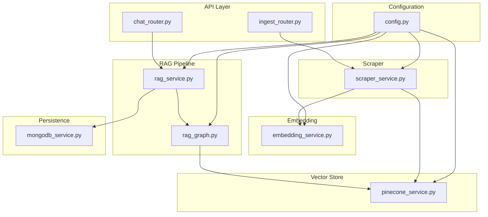
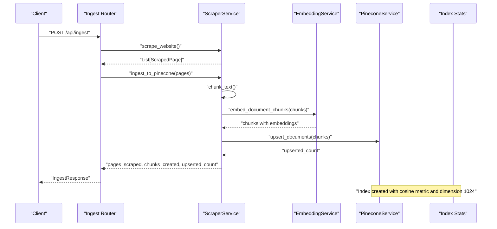
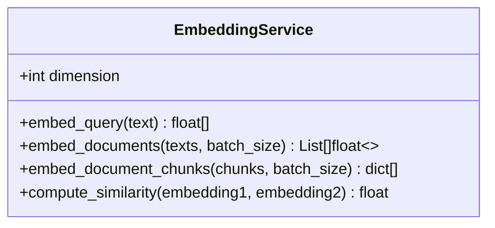
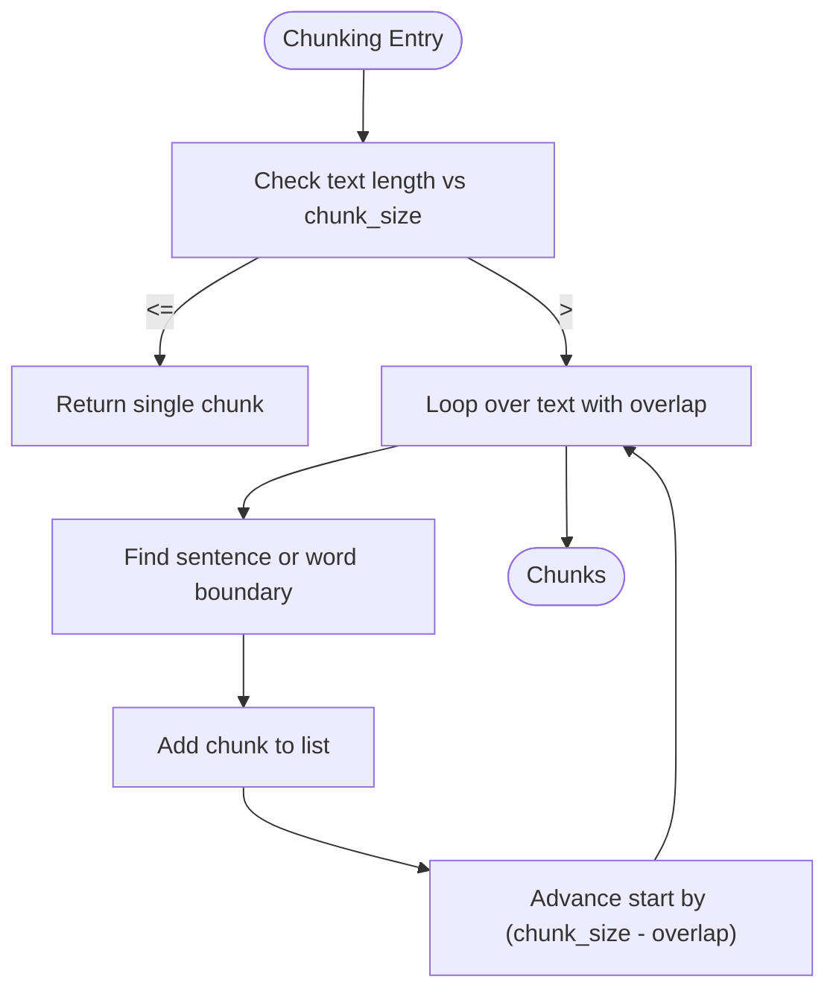
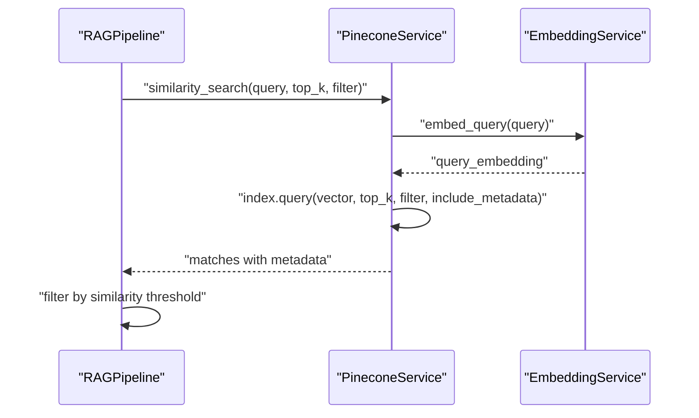
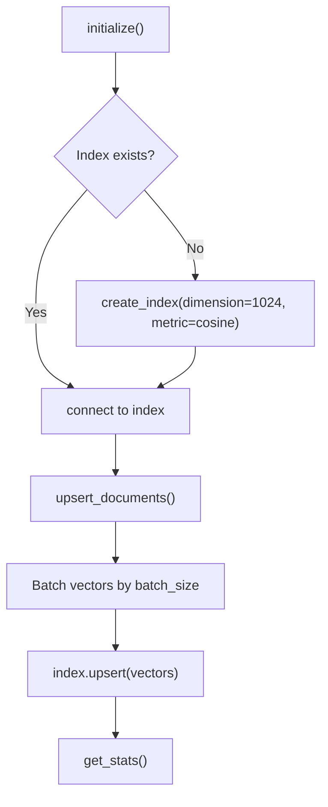
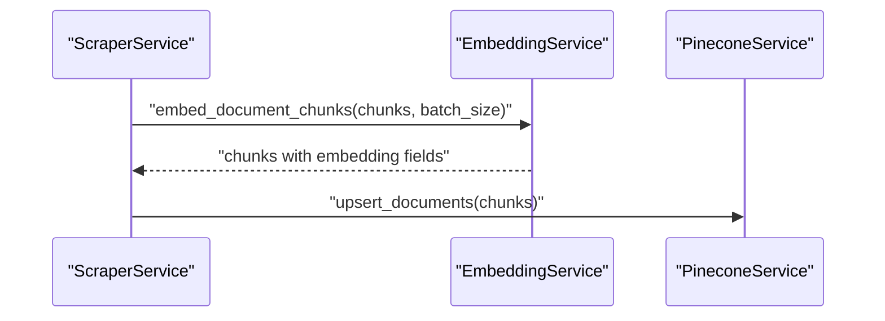
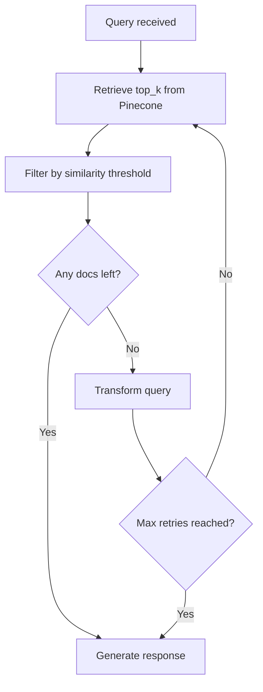
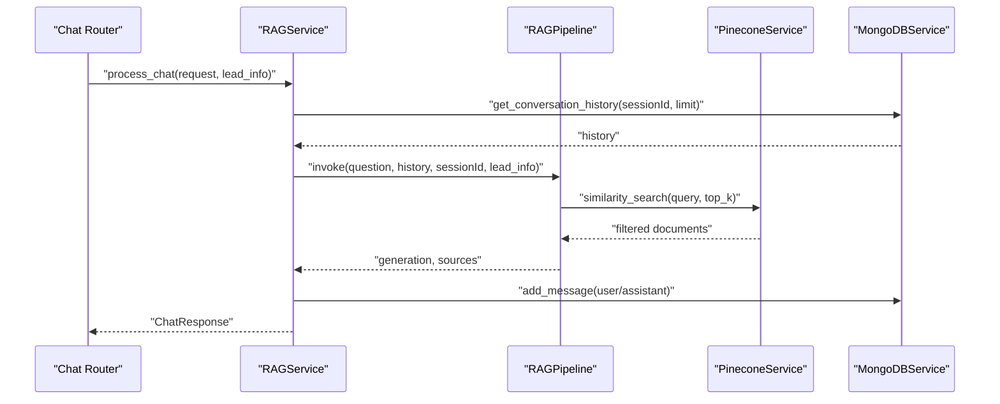
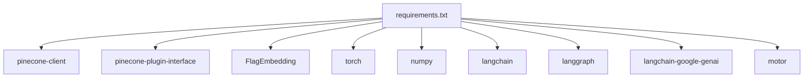

# Vector Database Integration

<cite>
**Referenced Files in This Document**
- [pinecone_service.py](file://backend/app/services/pinecone_service.py)
- [embedding_service.py](file://backend/app/services/embedding_service.py)
- [rag_graph.py](file://backend/app/graph/rag_graph.py)
- [rag_service.py](file://backend/app/services/rag_service.py)
- [config.py](file://backend/app/config.py)
- [scraper_service.py](file://backend/app/services/scraper_service.py)
- [ingest_router.py](file://backend/app/routers/ingest_router.py)
- [chat_router.py](file://backend/app/routers/chat_router.py)
- [mongodb_service.py](file://backend/app/services/mongodb_service.py)
- [main.py](file://backend/app/main.py)
- [requirements.txt](file://backend/requirements.txt)
</cite>

## Table of Contents
1. [Introduction](#introduction)
2. [Project Structure](#project-structure)
3. [Core Components](#core-components)
4. [Architecture Overview](#architecture-overview)
5. [Detailed Component Analysis](#detailed-component-analysis)
6. [Dependency Analysis](#dependency-analysis)
7. [Performance Considerations](#performance-considerations)
8. [Troubleshooting Guide](#troubleshooting-guide)
9. [Conclusion](#conclusion)
10. [Appendices](#appendices)

## Introduction
This document explains the Pinecone vector database integration for the Hitech RAG chatbot. It covers embedding model configuration using BGE-M3 (1024 dimensions), text chunking strategies, similarity search implementation, vector store indexing, embedding generation workflow, and the integration between the LangGraph pipeline and vector database operations. It also provides examples of document processing, embedding generation, semantic search queries, performance tuning, batch processing, memory management, and troubleshooting guidance.

## Project Structure
The vector database integration spans several backend modules:
- Configuration defines environment-driven settings for Pinecone, embeddings, and RAG behavior.
- Embedding service loads the BGE-M3 model and generates dense vectors for queries and documents.
- Scraper service extracts, cleans, and chunks content, then embeds and upserts to Pinecone.
- Pinecone service manages index lifecycle, upserts, and similarity search.
- LangGraph pipeline orchestrates retrieval, filtering, query transformation, and generation.
- RAG service coordinates conversation history and pipeline invocation.
- Routers expose ingestion and chat endpoints.
- MongoDB service persists leads, conversations, and messages.

**Diagram sources**
- [config.py:1-65](file://backend/app/config.py#L1-L65)
- [embedding_service.py:1-158](file://backend/app/services/embedding_service.py#L1-L158)
- [scraper_service.py:1-329](file://backend/app/services/scraper_service.py#L1-L329)
- [pinecone_service.py:1-186](file://backend/app/services/pinecone_service.py#L1-L186)
- [rag_graph.py:1-264](file://backend/app/graph/rag_graph.py#L1-L264)
- [rag_service.py:1-116](file://backend/app/services/rag_service.py#L1-L116)
- [ingest_router.py:1-112](file://backend/app/routers/ingest_router.py#L1-L112)
- [chat_router.py:1-130](file://backend/app/routers/chat_router.py#L1-L130)
- [mongodb_service.py:1-202](file://backend/app/services/mongodb_service.py#L1-L202)

**Section sources**
- [main.py:14-37](file://backend/app/main.py#L14-L37)
- [config.py:19-36](file://backend/app/config.py#L19-L36)

## Core Components
- Embedding Service: Singleton that loads BGE-M3 (1024 dimensions) on CPU, adds a query instruction for retrieval, and supports batch embedding for documents and chunks.
- Scraper Service: Extracts HTML content, cleans text, splits into overlapping chunks, and embeds chunks before upserting to Pinecone.
- Pinecone Service: Manages index creation (cosine metric), upserts vectors with metadata, performs similarity search, and exposes stats and deletion utilities.
- LangGraph RAG Pipeline: Orchestrates retrieval, document grading, query transformation, and generation with configurable thresholds and retry logic.
- RAG Service: Bridges chat requests with conversation history and the RAG pipeline, storing messages and sources.
- Routers: Expose ingestion and chat endpoints; ingestion triggers scraping, chunking, embedding, and upsert; chat invokes the RAG pipeline.

**Section sources**
- [embedding_service.py:10-158](file://backend/app/services/embedding_service.py#L10-L158)
- [scraper_service.py:26-329](file://backend/app/services/scraper_service.py#L26-L329)
- [pinecone_service.py:10-186](file://backend/app/services/pinecone_service.py#L10-L186)
- [rag_graph.py:26-264](file://backend/app/graph/rag_graph.py#L26-L264)
- [rag_service.py:11-116](file://backend/app/services/rag_service.py#L11-L116)
- [ingest_router.py:26-112](file://backend/app/routers/ingest_router.py#L26-L112)
- [chat_router.py:12-130](file://backend/app/routers/chat_router.py#L12-L130)

## Architecture Overview
The vector database integration follows a pipeline from ingestion to retrieval and generation:
- Ingestion: Website scraping, text cleaning, chunking, embedding generation, and batched upsert to Pinecone.
- Retrieval: Query embedding generation and similarity search against the index with optional filters.
- Generation: Context assembly from top-k documents and LLM prompting with conversation history.

**Diagram sources**
- [ingest_router.py:26-74](file://backend/app/routers/ingest_router.py#L26-L74)
- [scraper_service.py:250-306](file://backend/app/services/scraper_service.py#L250-L306)
- [embedding_service.py:106-126](file://backend/app/services/embedding_service.py#L106-L126)
- [pinecone_service.py:62-106](file://backend/app/services/pinecone_service.py#L62-L106)

**Section sources**
- [main.py:24-25](file://backend/app/main.py#L24-L25)
- [config.py:19-24](file://backend/app/config.py#L19-L24)

## Detailed Component Analysis

### Embedding Model Configuration (BGE-M3)
- Model: BGE-M3 with 1024 dimensions.
- Device: CPU for serverless deployment compatibility.
- Query instruction: Adds a retrieval instruction to improve query embeddings.
- Batch processing: Supports batch embedding for documents and chunks with tunable batch sizes.

**Diagram sources**
- [embedding_service.py:10-158](file://backend/app/services/embedding_service.py#L10-L158)

**Section sources**
- [embedding_service.py:22-48](file://backend/app/services/embedding_service.py#L22-L48)
- [embedding_service.py:55-77](file://backend/app/services/embedding_service.py#L55-L77)
- [embedding_service.py:79-104](file://backend/app/services/embedding_service.py#L79-L104)
- [embedding_service.py:106-126](file://backend/app/services/embedding_service.py#L106-L126)
- [config.py:23](file://backend/app/config.py#L23)

### Chunking Strategies
- Overlapping chunks: Uses configurable chunk size and overlap to preserve context across boundaries.
- Boundary-aware splitting: Prefers sentence endings and word boundaries to avoid truncating mid-word.
- Cleaning: Removes excessive whitespace and filters out non-content artifacts during scraping.

**Diagram sources**
- [scraper_service.py:164-194](file://backend/app/services/scraper_service.py#L164-L194)

**Section sources**
- [scraper_service.py:164-194](file://backend/app/services/scraper_service.py#L164-L194)
- [config.py:34-35](file://backend/app/config.py#L34-L35)

### Similarity Search Implementation
- Query embedding: Generated using the embedding service with retrieval instruction.
- Index metric: Cosine similarity configured in Pinecone.
- Filtering: Optional metadata filters can be applied to restrict results.
- Thresholding: Results filtered by a configurable similarity threshold in the pipeline.

**Diagram sources**
- [rag_graph.py:71-91](file://backend/app/graph/rag_graph.py#L71-L91)
- [pinecone_service.py:108-154](file://backend/app/services/pinecone_service.py#L108-L154)
- [embedding_service.py:55-77](file://backend/app/services/embedding_service.py#L55-L77)

**Section sources**
- [pinecone_service.py:108-154](file://backend/app/services/pinecone_service.py#L108-L154)
- [rag_graph.py:71-91](file://backend/app/graph/rag_graph.py#L71-L91)
- [config.py:32-33](file://backend/app/config.py#L32-L33)

### Vector Store Indexing Process
- Initialization: Creates index with dimension 1024 and cosine metric if missing.
- Upsert: Converts documents to vectors with metadata and batches upserts.
- Metadata: Stores content, source, title, URL, timestamp, and chunk index.
- Deletion: Supports clearing all vectors or deleting by filter.

**Diagram sources**
- [pinecone_service.py:27-55](file://backend/app/services/pinecone_service.py#L27-L55)
- [pinecone_service.py:62-106](file://backend/app/services/pinecone_service.py#L62-L106)
- [config.py:23](file://backend/app/config.py#L23)

**Section sources**
- [pinecone_service.py:27-55](file://backend/app/services/pinecone_service.py#L27-L55)
- [pinecone_service.py:62-106](file://backend/app/services/pinecone_service.py#L62-L106)
- [config.py:19-24](file://backend/app/config.py#L19-L24)

### Embedding Generation Workflow
- Query embedding: Adds retrieval instruction and encodes with BGE-M3.
- Document embedding: Encodes lists of texts with batch processing.
- Chunk embedding: Attaches embeddings to chunk dictionaries for upsert.

**Diagram sources**
- [scraper_service.py:294](file://backend/app/services/scraper_service.py#L294)
- [embedding_service.py:106-126](file://backend/app/services/embedding_service.py#L106-L126)
- [pinecone_service.py:62-106](file://backend/app/services/pinecone_service.py#L62-L106)

**Section sources**
- [embedding_service.py:55-77](file://backend/app/services/embedding_service.py#L55-L77)
- [embedding_service.py:79-104](file://backend/app/services/embedding_service.py#L79-L104)
- [embedding_service.py:106-126](file://backend/app/services/embedding_service.py#L106-L126)

### Query Optimization Techniques
- Threshold filtering: Filters results below a similarity threshold to reduce noise.
- Top-k selection: Limits retrieved documents to a small set for generation.
- Query transformation: Uses LLM to reformulate queries when no relevant documents are found.
- Retry logic: Retries up to a fixed number of transformations before generating.

**Diagram sources**
- [rag_graph.py:71-121](file://backend/app/graph/rag_graph.py#L71-L121)
- [config.py:32-33](file://backend/app/config.py#L32-L33)

**Section sources**
- [rag_graph.py:71-121](file://backend/app/graph/rag_graph.py#L71-L121)
- [config.py:32-33](file://backend/app/config.py#L32-L33)

### Integration Between LangGraph Pipeline and Vector Database
- RAGPipeline retrieves documents, grades them, transforms queries when necessary, and generates responses.
- PineconeService is injected into the pipeline to perform similarity search.
- Conversation history is fetched from MongoDB and passed to the pipeline for contextual generation.

**Diagram sources**
- [chat_router.py:12-56](file://backend/app/routers/chat_router.py#L12-L56)
- [rag_service.py:19-87](file://backend/app/services/rag_service.py#L19-L87)
- [rag_graph.py:221-251](file://backend/app/graph/rag_graph.py#L221-L251)
- [rag_graph.py:71-91](file://backend/app/graph/rag_graph.py#L71-L91)
- [mongodb_service.py:135-145](file://backend/app/services/mongodb_service.py#L135-L145)

**Section sources**
- [rag_service.py:19-87](file://backend/app/services/rag_service.py#L19-L87)
- [rag_graph.py:221-251](file://backend/app/graph/rag_graph.py#L221-L251)

### Examples

#### Document Processing and Embedding Generation
- Scrape website pages, clean content, split into overlapping chunks, embed with BGE-M3, and upsert to Pinecone.
- Example path: [scraper_service.py:250-306](file://backend/app/services/scraper_service.py#L250-L306)

#### Semantic Search Queries
- Generate query embedding and perform similarity search with optional filters.
- Example path: [pinecone_service.py:108-154](file://backend/app/services/pinecone_service.py#L108-L154)

#### Query Optimization
- Apply similarity threshold filtering and query transformation when no relevant documents are found.
- Example path: [rag_graph.py:71-121](file://backend/app/graph/rag_graph.py#L71-L121)

**Section sources**
- [scraper_service.py:250-306](file://backend/app/services/scraper_service.py#L250-L306)
- [pinecone_service.py:108-154](file://backend/app/services/pinecone_service.py#L108-L154)
- [rag_graph.py:71-121](file://backend/app/graph/rag_graph.py#L71-L121)

## Dependency Analysis
External dependencies relevant to vector database integration:
- Pinecone client and serverless spec for index creation and querying.
- BGE-M3 embedding model via FlagEmbedding with CPU device and FP32 precision.
- LangChain and LangGraph for RAG orchestration.
- MongoDB for conversation persistence.

**Diagram sources**
- [requirements.txt:12-41](file://backend/requirements.txt#L12-L41)

**Section sources**
- [requirements.txt:12-41](file://backend/requirements.txt#L12-L41)

## Performance Considerations
- Embedding batch sizing: Tune batch_size in embedding generation to balance throughput and memory usage.
- Upsert batching: Use batch_size in upsert_documents to minimize network overhead.
- Chunk size and overlap: Adjust CHUNK_SIZE and CHUNK_OVERLAP to optimize recall and context retention.
- Similarity threshold: Calibrate RAG_SIMILARITY_THRESHOLD to reduce noise and improve relevance.
- Index dimension: Ensure Pinecone dimension matches embedding dimension (1024).
- Memory management: Embedding model is loaded once as a singleton; avoid reloading by leveraging the singleton instance.
- Network latency: Pinecone operations are remote; consider caching frequently accessed metadata and minimizing repeated queries.

[No sources needed since this section provides general guidance]

## Troubleshooting Guide
Common issues and resolutions:
- Pinecone initialization failures: Verify API key and index name; ensure index exists or allow automatic creation.
  - Reference: [pinecone_service.py:27-55](file://backend/app/services/pinecone_service.py#L27-L55)
- Empty or invalid embeddings: Ensure input text is non-empty and properly cleaned; confirm BGE-M3 model loads successfully.
  - Reference: [embedding_service.py:65-67](file://backend/app/services/embedding_service.py#L65-L67), [embedding_service.py:45-48](file://backend/app/services/embedding_service.py#L45-L48)
- Low similarity scores: Increase top_k or adjust similarity threshold; consider query transformation.
  - Reference: [rag_graph.py:71-91](file://backend/app/graph/rag_graph.py#L71-L91), [config.py:32-33](file://backend/app/config.py#L32-L33)
- Ingestion errors: Check that scraped content meets minimum length; validate chunking parameters.
  - Reference: [scraper_service.py:266-289](file://backend/app/services/scraper_service.py#L266-L289)
- Health checks: Use the health endpoint to verify MongoDB and Pinecone connectivity.
  - Reference: [main.py:74-83](file://backend/app/main.py#L74-L83)

**Section sources**
- [pinecone_service.py:27-55](file://backend/app/services/pinecone_service.py#L27-L55)
- [embedding_service.py:65-67](file://backend/app/services/embedding_service.py#L65-L67)
- [embedding_service.py:45-48](file://backend/app/services/embedding_service.py#L45-L48)
- [rag_graph.py:71-91](file://backend/app/graph/rag_graph.py#L71-L91)
- [config.py:32-33](file://backend/app/config.py#L32-L33)
- [scraper_service.py:266-289](file://backend/app/services/scraper_service.py#L266-L289)
- [main.py:74-83](file://backend/app/main.py#L74-L83)

## Conclusion
The Pinecone vector database integration leverages BGE-M3 embeddings (1024 dimensions) with robust chunking, batched upserts, and configurable similarity search. The LangGraph pipeline orchestrates retrieval, filtering, query transformation, and generation, while MongoDB persists conversation history. Proper configuration of chunking, thresholds, and batch sizes ensures efficient performance for large knowledgebases.

[No sources needed since this section summarizes without analyzing specific files]

## Appendices

### Configuration Reference
Key settings affecting vector database integration:
- Pinecone: API key, environment, index name, dimension.
- Embeddings: Model dimension (1024).
- RAG: top_k, similarity threshold, chunk size, overlap.
- Session: conversation history limit.

**Section sources**
- [config.py:19-44](file://backend/app/config.py#L19-L44)