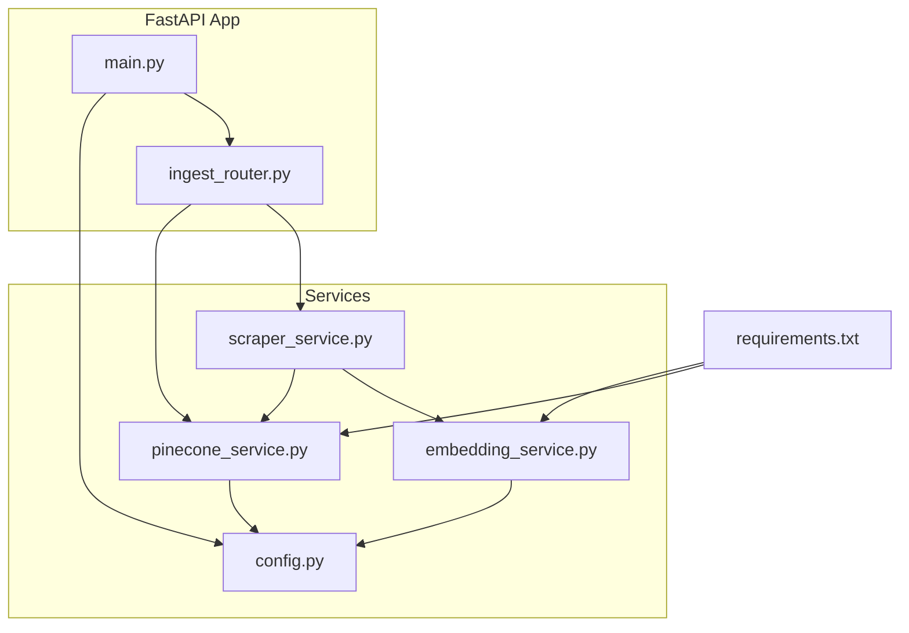
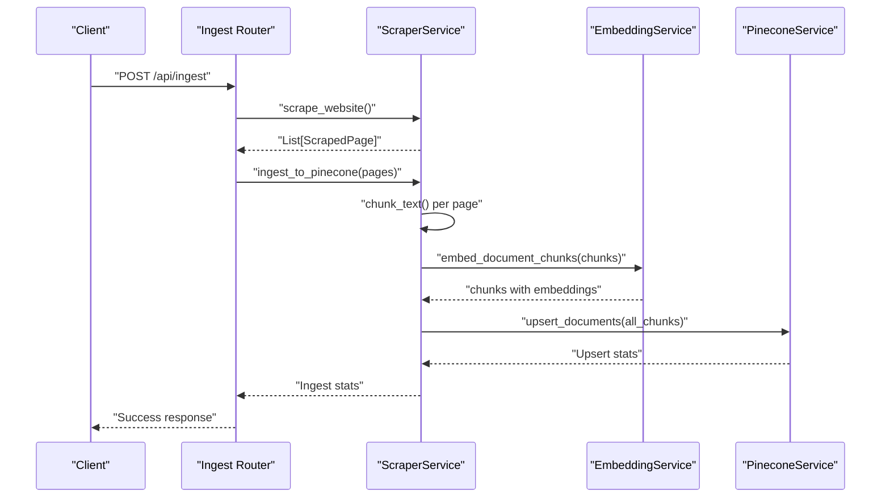
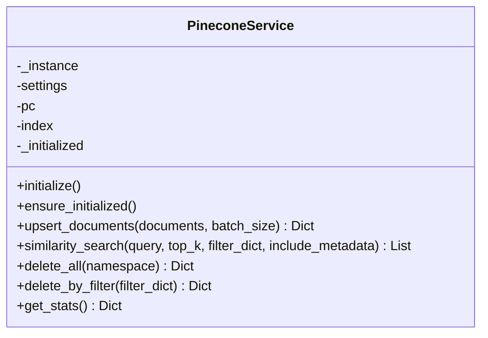
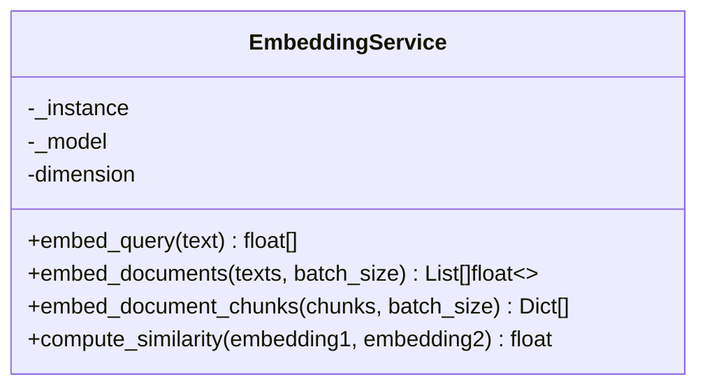
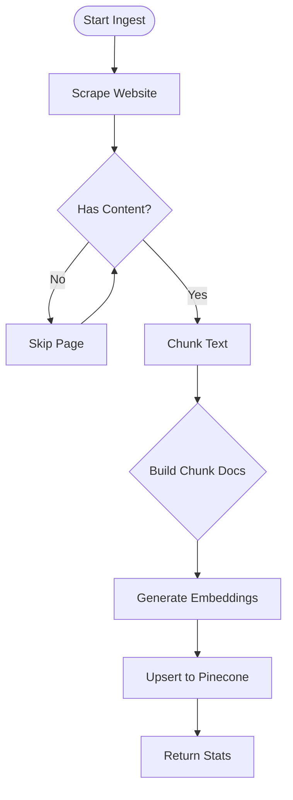
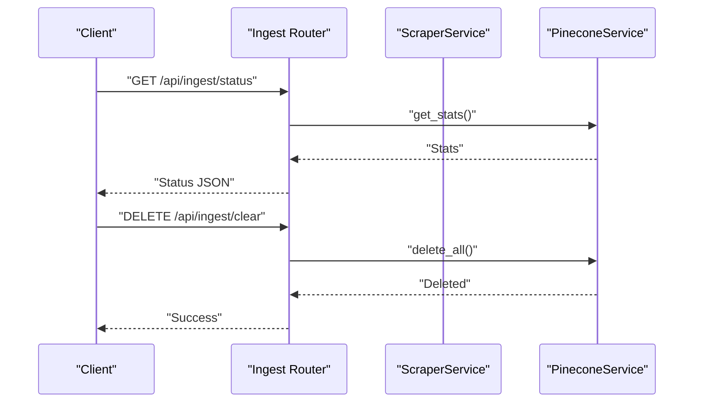
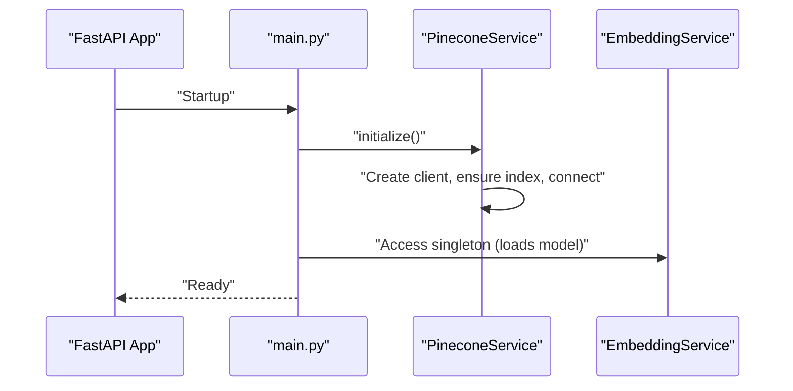
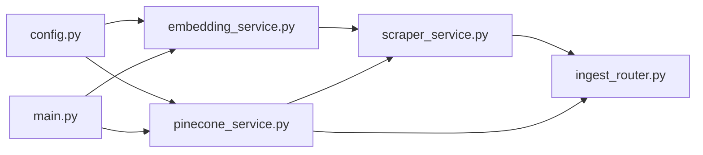

# Vector Indexing and Upsert Operations

<cite>
**Referenced Files in This Document**
- [pinecone_service.py](file://backend/app/services/pinecone_service.py)
- [embedding_service.py](file://backend/app/services/embedding_service.py)
- [scraper_service.py](file://backend/app/services/scraper_service.py)
- [ingest_router.py](file://backend/app/routers/ingest_router.py)
- [config.py](file://backend/app/config.py)
- [main.py](file://backend/app/main.py)
- [requirements.txt](file://backend/requirements.txt)
</cite>

## Table of Contents
1. [Introduction](#introduction)
2. [Project Structure](#project-structure)
3. [Core Components](#core-components)
4. [Architecture Overview](#architecture-overview)
5. [Detailed Component Analysis](#detailed-component-analysis)
6. [Dependency Analysis](#dependency-analysis)
7. [Performance Considerations](#performance-considerations)
8. [Troubleshooting Guide](#troubleshooting-guide)
9. [Conclusion](#conclusion)
10. [Appendices](#appendices)

## Introduction
This document explains vector indexing and upsert operations in Pinecone within the backend. It focuses on the upsert_documents method, batch processing strategies, vector ID generation, metadata handling, document chunking, vector creation workflow, and index management. It also documents the singleton pattern implementation, initialization sequence, and operational guidance for bulk upserts, error handling, performance optimization, index scaling, namespace management, and maintenance operations for large-scale knowledgebases.

## Project Structure
The vector ingestion pipeline spans several modules:
- Configuration defines environment-driven settings for Pinecone and chunking.
- Embedding service generates dense vectors using BGE-M3.
- Scraper service extracts, cleans, and chunks content, then attaches embeddings.
- Pinecone service initializes the client, ensures the index exists, and performs upserts and queries.
- Ingest router exposes endpoints to trigger ingestion and manage the knowledgebase.
- Main application lifecycle initializes services and connects to Pinecone at startup.

**Diagram sources**
- [main.py:14-37](file://backend/app/main.py#L14-L37)
- [ingest_router.py:26-73](file://backend/app/routers/ingest_router.py#L26-L73)
- [scraper_service.py:250-306](file://backend/app/services/scraper_service.py#L250-L306)
- [embedding_service.py:106-126](file://backend/app/services/embedding_service.py#L106-L126)
- [pinecone_service.py:27-55](file://backend/app/services/pinecone_service.py#L27-L55)
- [config.py:19-24](file://backend/app/config.py#L19-L24)
- [requirements.txt:12-14](file://backend/requirements.txt#L12-L14)

**Section sources**
- [main.py:14-37](file://backend/app/main.py#L14-L37)
- [ingest_router.py:26-73](file://backend/app/routers/ingest_router.py#L26-L73)
- [scraper_service.py:250-306](file://backend/app/services/scraper_service.py#L250-L306)
- [embedding_service.py:106-126](file://backend/app/services/embedding_service.py#L106-L126)
- [pinecone_service.py:27-55](file://backend/app/services/pinecone_service.py#L27-L55)
- [config.py:19-24](file://backend/app/config.py#L19-L24)
- [requirements.txt:12-14](file://backend/requirements.txt#L12-L14)

## Core Components
- PineconeService: Singleton managing Pinecone client, index lifecycle, upsert, query, and maintenance operations.
- EmbeddingService: Singleton that loads BGE-M3 and computes embeddings for queries and documents.
- ScraperService: Extracts pages, chunks content, attaches metadata, and generates embeddings before upserting.
- Ingest Router: Exposes endpoints to ingest knowledgebase, check stats, and clear the index.
- Configuration: Centralized settings for Pinecone, chunking, and RAG parameters.
- Application Lifecycle: Initializes MongoDB, Pinecone, and embedding model at startup.

Key responsibilities:
- Vector ID generation: Uses UUID when not provided.
- Metadata handling: Stores content, source, title, URL, timestamp, and chunk_index.
- Batch processing: Splits vectors into configurable batches for upsert.
- Index management: Ensures index existence, describes stats, deletes all or by filter.

**Section sources**
- [pinecone_service.py:10-186](file://backend/app/services/pinecone_service.py#L10-L186)
- [embedding_service.py:10-158](file://backend/app/services/embedding_service.py#L10-L158)
- [scraper_service.py:164-194](file://backend/app/services/scraper_service.py#L164-L194)
- [ingest_router.py:26-112](file://backend/app/routers/ingest_router.py#L26-L112)
- [config.py:19-36](file://backend/app/config.py#L19-L36)
- [main.py:14-37](file://backend/app/main.py#L14-L37)

## Architecture Overview
The ingestion pipeline follows a clear flow: scrape -> chunk -> embed -> upsert. The query pipeline embeds the query and performs similarity search against the index.

**Diagram sources**
- [ingest_router.py:26-73](file://backend/app/routers/ingest_router.py#L26-L73)
- [scraper_service.py:195-248](file://backend/app/services/scraper_service.py#L195-L248)
- [scraper_service.py:250-306](file://backend/app/services/scraper_service.py#L250-L306)
- [embedding_service.py:106-126](file://backend/app/services/embedding_service.py#L106-L126)
- [pinecone_service.py:62-106](file://backend/app/services/pinecone_service.py#L62-L106)

## Detailed Component Analysis

### PineconeService: Initialization, Singleton, and Upsert
- Singleton pattern: Ensures a single Pinecone client and index handle across the app.
- Initialization sequence: Creates client, checks index existence, creates index if missing, connects to index, marks initialized.
- upsert_documents:
  - Builds vector list with IDs and metadata.
  - Supports custom IDs; otherwise generates UUIDs.
  - Batches vectors and performs upserts.
  - Returns upserted count and index name.
- similarity_search: Embeds query via EmbeddingService and queries index with optional filters.
- Maintenance: delete_all(namespace), delete_by_filter(filter_dict), get_stats().
- Index creation uses serverless spec with AWS cloud and us-east-1 region.

**Diagram sources**
- [pinecone_service.py:10-186](file://backend/app/services/pinecone_service.py#L10-L186)

**Section sources**
- [pinecone_service.py:10-186](file://backend/app/services/pinecone_service.py#L10-L186)
- [config.py:19-24](file://backend/app/config.py#L19-L24)

### EmbeddingService: Model Loading and Batch Embedding
- Singleton pattern: Loads BGE-M3 model once and caches it.
- embed_query: Prepares query with instruction and encodes to dense vector.
- embed_documents: Encodes multiple texts in batches.
- embed_document_chunks: Adds embeddings to chunk dictionaries.
- compute_similarity: Computes cosine similarity between two vectors.

**Diagram sources**
- [embedding_service.py:10-158](file://backend/app/services/embedding_service.py#L10-L158)

**Section sources**
- [embedding_service.py:10-158](file://backend/app/services/embedding_service.py#L10-L158)

### ScraperService: Chunking, Metadata, and Ingestion Pipeline
- chunk_text: Overlapping chunking respecting sentence and word boundaries.
- ingest_to_pinecone: Orchestrates chunking, embedding, and upsert.
- Metadata fields: content, source, title, url, timestamp, chunk_index.
- Vector ID generation: Uses UUID when not provided.

**Diagram sources**
- [scraper_service.py:195-248](file://backend/app/services/scraper_service.py#L195-L248)
- [scraper_service.py:250-306](file://backend/app/services/scraper_service.py#L250-L306)
- [embedding_service.py:106-126](file://backend/app/services/embedding_service.py#L106-L126)
- [pinecone_service.py:62-106](file://backend/app/services/pinecone_service.py#L62-L106)

**Section sources**
- [scraper_service.py:164-194](file://backend/app/services/scraper_service.py#L164-L194)
- [scraper_service.py:250-306](file://backend/app/services/scraper_service.py#L250-L306)
- [embedding_service.py:106-126](file://backend/app/services/embedding_service.py#L106-L126)
- [pinecone_service.py:62-106](file://backend/app/services/pinecone_service.py#L62-L106)

### Ingest Router: Endpoints and Status
- POST /api/ingest: Triggers scraping, chunking, embedding, and upsert; returns ingestion stats.
- GET /api/ingest/status: Returns vector store statistics.
- DELETE /api/ingest/clear: Clears all vectors from the index.

**Diagram sources**
- [ingest_router.py:76-92](file://backend/app/routers/ingest_router.py#L76-L92)
- [ingest_router.py:95-112](file://backend/app/routers/ingest_router.py#L95-L112)
- [pinecone_service.py:156-160](file://backend/app/services/pinecone_service.py#L156-L160)
- [pinecone_service.py:168-176](file://backend/app/services/pinecone_service.py#L168-L176)

**Section sources**
- [ingest_router.py:26-112](file://backend/app/routers/ingest_router.py#L26-L112)
- [pinecone_service.py:156-176](file://backend/app/services/pinecone_service.py#L156-L176)

### Configuration and Initialization Sequence
- Settings define Pinecone API key, index name, dimension, and chunking parameters.
- Application lifespan initializes MongoDB, Pinecone, and loads the embedding model at startup.

**Diagram sources**
- [main.py:14-37](file://backend/app/main.py#L14-L37)
- [pinecone_service.py:27-55](file://backend/app/services/pinecone_service.py#L27-L55)
- [config.py:19-24](file://backend/app/config.py#L19-L24)

**Section sources**
- [config.py:19-24](file://backend/app/config.py#L19-L24)
- [main.py:14-37](file://backend/app/main.py#L14-L37)
- [pinecone_service.py:27-55](file://backend/app/services/pinecone_service.py#L27-L55)

## Dependency Analysis
- PineconeService depends on configuration and EmbeddingService for query embeddings.
- ScraperService depends on EmbeddingService and PineconeService.
- Ingest Router depends on ScraperService and PineconeService.
- Application lifecycle depends on PineconeService and EmbeddingService.

**Diagram sources**
- [config.py:19-24](file://backend/app/config.py#L19-L24)
- [pinecone_service.py:27-55](file://backend/app/services/pinecone_service.py#L27-L55)
- [embedding_service.py:10-28](file://backend/app/services/embedding_service.py#L10-L28)
- [scraper_service.py:12-14](file://backend/app/services/scraper_service.py#L12-L14)
- [ingest_router.py:6-7](file://backend/app/routers/ingest_router.py#L6-L7)
- [main.py:14-37](file://backend/app/main.py#L14-L37)

**Section sources**
- [config.py:19-24](file://backend/app/config.py#L19-L24)
- [pinecone_service.py:27-55](file://backend/app/services/pinecone_service.py#L27-L55)
- [embedding_service.py:10-28](file://backend/app/services/embedding_service.py#L10-L28)
- [scraper_service.py:12-14](file://backend/app/services/scraper_service.py#L12-L14)
- [ingest_router.py:6-7](file://backend/app/routers/ingest_router.py#L6-L7)
- [main.py:14-37](file://backend/app/main.py#L14-L37)

## Performance Considerations
- Batch sizing:
  - upsert_documents uses a configurable batch_size; adjust based on memory and latency targets.
  - embed_document_chunks uses a default batch_size of 8; tune for throughput vs. memory.
- Embedding model:
  - BGE-M3 runs on CPU with FP32 for compatibility; consider GPU acceleration if available.
- Index dimension:
  - Dimension matches BGE-M3 (1024); ensure embeddings align.
- Network and retries:
  - Pinecone client handles retries internally; ensure stable network connectivity.
- Memory management:
  - Process chunks incrementally; avoid loading all embeddings into memory at once.
- Query performance:
  - similarity_search supports filtering and metadata inclusion; keep filters selective to reduce scan cost.

[No sources needed since this section provides general guidance]

## Troubleshooting Guide
Common issues and resolutions:
- Pinecone index not found:
  - The service auto-creates the index if missing; verify API key and region settings.
- Empty or invalid content:
  - Scraper skips pages with insufficient content; ensure site structure is crawlable.
- No embeddings generated:
  - Embedding model must load successfully; check logs for model load errors.
- Partial failures during upsert:
  - Current implementation does not catch individual batch failures; wrap calls with retry logic and track partial progress externally.
- Namespace management:
  - delete_all accepts a namespace parameter; use namespaces to isolate environments or tenants.
- Maintenance operations:
  - Use delete_all(namespace) for environment resets; use delete_by_filter for targeted cleanup.

**Section sources**
- [pinecone_service.py:27-55](file://backend/app/services/pinecone_service.py#L27-L55)
- [scraper_service.py:266-289](file://backend/app/services/scraper_service.py#L266-L289)
- [embedding_service.py:30-48](file://backend/app/services/embedding_service.py#L30-L48)
- [pinecone_service.py:156-166](file://backend/app/services/pinecone_service.py#L156-L166)

## Conclusion
The system implements a robust ingestion pipeline from scraping to vector storage, with clear separation of concerns across services. PineconeService centralizes index operations and maintains a singleton client. EmbeddingService encapsulates model loading and encoding. ScraperService orchestrates chunking and metadata enrichment. The ingest router exposes operational endpoints for ingestion, status, and clearing. For production at scale, consider adding error handling around batch upserts, namespace isolation, and periodic maintenance tasks.

[No sources needed since this section summarizes without analyzing specific files]

## Appendices

### Bulk Upsert Operations
- Use upsert_documents with a suitable batch_size to balance throughput and memory.
- Ensure each document has an embedding; the pipeline attaches embeddings before upsert.

**Section sources**
- [pinecone_service.py:62-106](file://backend/app/services/pinecone_service.py#L62-L106)
- [scraper_service.py:294-299](file://backend/app/services/scraper_service.py#L294-L299)

### Error Handling for Partial Failures
- Current implementation does not catch individual batch failures during upsert.
- Recommended approach: Wrap upsert_batches in try/except blocks, log failures, and implement retry with exponential backoff.

**Section sources**
- [pinecone_service.py:96-106](file://backend/app/services/pinecone_service.py#L96-L106)

### Performance Optimization Techniques
- Tune batch_size in both embed_document_chunks and upsert_documents.
- Pre-compute embeddings for static content to reduce repeated computation.
- Use similarity_search filters to constrain results and improve latency.

**Section sources**
- [embedding_service.py:79-104](file://backend/app/services/embedding_service.py#L79-L104)
- [pinecone_service.py:108-154](file://backend/app/services/pinecone_service.py#L108-L154)

### Index Scaling Strategies
- Serverless spec is configured for AWS us-east-1; evaluate regional proximity and workload patterns.
- Monitor index stats via get_stats to assess growth and fullness.

**Section sources**
- [pinecone_service.py:41-49](file://backend/app/services/pinecone_service.py#L41-L49)
- [pinecone_service.py:168-176](file://backend/app/services/pinecone_service.py#L168-L176)

### Namespace Management and Maintenance
- Use delete_all(namespace) to reset or segment environments.
- Use delete_by_filter(filter_dict) to remove specific documents by metadata criteria.
- Periodic cleanup of old sessions and conversations helps maintain DB health.

**Section sources**
- [pinecone_service.py:156-166](file://backend/app/services/pinecone_service.py#L156-L166)
- [mongodb_service.py:182-192](file://backend/app/services/mongodb_service.py#L182-L192)